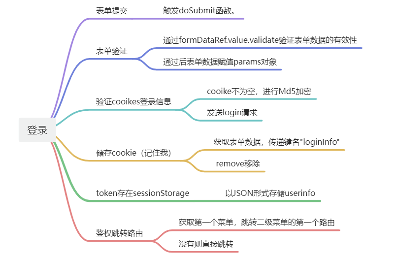
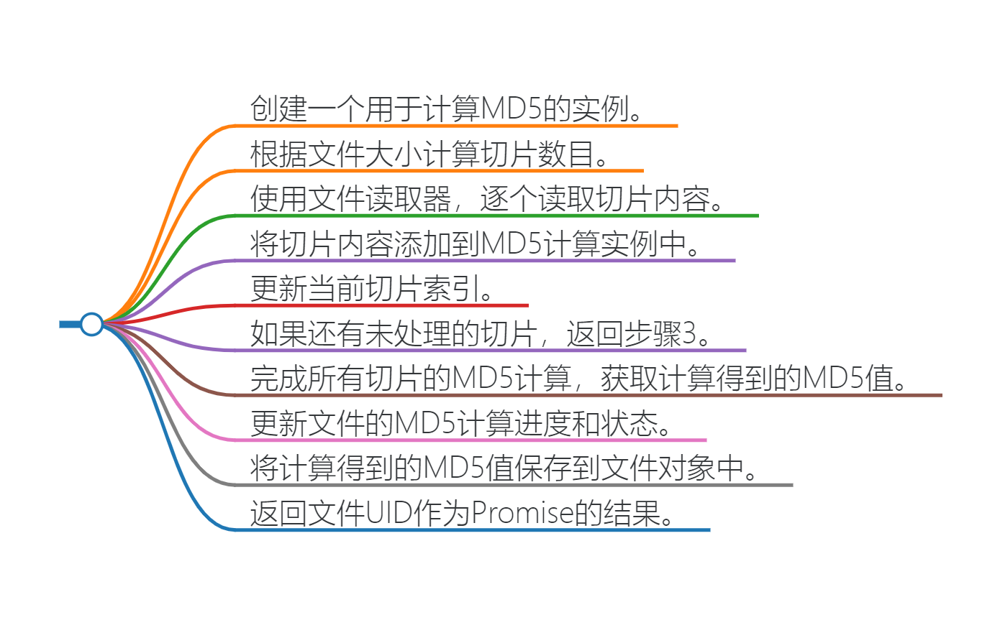
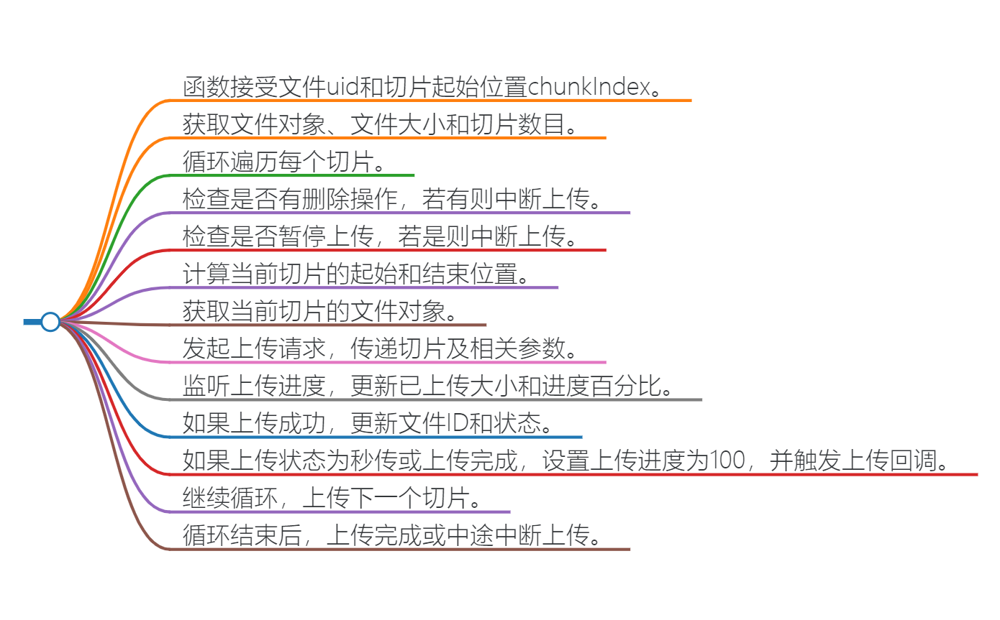

## 云盘简介

项目描述:<br>
  **[easy云盘](http://easypan.wuhancoder.com/)** 一个仿百度云盘面向C端用户的网盘项目，基于
    构建开发<br>


具体功能：
> 1. 用户注册，登录，QQ快捷登录，发送邮箱验证码，找回密码。<br>
> 2. 文件分片上传，断点续传，秒传，上传进度展示，文件预览，新建目录，文件重命名，文件移动，文件分享，删除，下载 等功能。<br>
> 3. 文件分享列表，取消分享。<br>
> 4. 回收站功能，还原文件，彻底删除。<br>
> 5. 设置模块  <br>
    - 超级管理员可以看到所有用户上传的文件，可以对文件下载，删除。   <br>
    - 超级管理员可以对用户进行管理，给用户分配空间，禁用、启用用户  <br>
    - 超级管理员可以对系统进行设置，设置邮箱模板，设置用户注册初始化空间大小。  <br>
> 6. 用户通过分享链接和分享码预览下载其他人分享的文件，同时也可以将文件保存到自己的网盘。

> [!IMPORTANT] 前端技术栈：
> `vite` + `vue3` + `axios` + `pinia` + `router` + `js`
***

## 前言
<span style="font-weight:bolder; color:#FE6C37">工欲善其事，必先利其器。</span>
计算机不是文科，不是天天拿记事本写代码、反复背代码单次就能学会的，所以不要折磨自己，能省事则省事，<br>
配置一个自己的代码片段，重点放在代码的思考，不要把时间浪费在重复劳动上，不然和新时代农民工有什么区别？<br>
对于代码建议，我建议买一份源码，把不必要的css直接拷贝，遇到问题可以替换源码查找病因，然后一步步找debugger问题所在<br>
<span style="border-bottom:2px dashed #3512C7;">代码片段不生效解决方法：新建一个新的全局代码片段文件</span>
#### 友情链接
* [老罗的Vscode代码片段](https://wwur.lanzout.com/ini770ngg78b)（密码:`fvmy`）
* [老罗的EasyShop](http://easyshop.wuhancoder.com )
* [老罗的所有免费资料](https://docs.qq.com/doc/DY1VMamFaWUttWnhi)<br>


## 环境部署

#### 安装Node.js
版本要求：v16.20.0
* [Node.js下载](https://nodejs.org/download/release/v16.20.2/node-v16.20.2-x64.msi)

**node建议：使用nvm安装，方便管理多个版本，可以随时切换**<br>
**镜像建议：使用nrm安装，方便切换镜像源，下载更快**<br>

```
node -v
```
#### npm换源
npm需要切换淘宝源，淘宝换地址了，所以有的同学用不了
::: code-group

``` [查看镜像]
npm config get registry
```

``` [切换淘宝镜像]
npm config set registry https://registry.npmmirror.com/

```

:::
#### 使用自己的图标样式：
关键词搜索:`iconfont的使用与合并_iconfont怎么合并`
#### 项目构建 elementPlus的引入：
```
// 引入elemnt-plus
import ElementPlus from 'element-plus'
import 'element-plus/dist/index.css'

app.use(ElementPlus)
```
#### app.vue  Plus中文国际化（不改导致英文）
```
<script setup>
  import zhCn from 'element-plus/dist/locale/zh-cn.mjs'
  const locale = zhCn;
</script>

<template>
    <el-config-provider :locale="locale">
        <RouterView />
    </el-config-provider>
</template>
```
#### Plus弹框Message消息弹框仅一个
```
 <el-config-provider :locale="locale" :message="config">
   
<script setup>
import { reactive } from "vue";
const config = reactive({
  max: 1,
});

</script>
```

***
## 目录结构
> [!NOTE] 目录结构
├── .vscode # vscode 配置<br>
├── public # 静态资源<br>
├── src # 项目代码<br>
│   ├── assets # 静态资源、icon、公共css<br>
│   ├── components # 公用组件<br>
│   ├── js # 定义了不同文件类型的类别及其允许的文件扩展名。<br>
│   ├── utils # 工具类、包括消息提示、request请求、校验<br>
│   ├── router # 路由配置<br>
│   ├── utils # 全局工具类<br>
│   ├── views # 路由页面<br>
│   ├── App.vue # 入口vue文件<br>
│   └── maain.js # 主入口文件<br>
├── index.html # 入口页面<br>
├── package.json # 项目配置文件<br>
├── vite.config.js # vite 配置<br>

## 通用组件封装
它可以帮助我们提高代码复用性和可维护性。通过封装通用组件，我们可以将组件的逻辑、样式和结构封装在一个可重用的组件中，以便在不同的页面和组件中使用。
在罗老师的项目里很多组件都是封装好的，比如弹窗组件、表格组件、上传组件等等。
#### 如何注册
Vue 注册组件有两种方式：全局注册、局部注册。

##### 1.局部注册
在对应的 Vue 页面中，使用 components 属性来注册组件。代码如下：

```
<template>
     <AvatarUpload v-model="formData.avatar"></AvatarUpload>
</template>

<script setup>
import AvatarUpload from "../componts/AvatarUpload.vue";
</script>

```
##### 2.全局注册
① 在 maain.js 中，全局注册组件。代码如下：
```
import Table from '@/componts/Table.vue'
app.component("Table",Table)
```

② 在对应的 Vue 页面中，直接使用组件，无需注册。代码如下：

```
<template>
<Table
    ref="dataTableRef"
    :columns="columns" 
    :dataSource="tableData"
    >
</table>
</template>
```
基础组件我写在了另一层，点击查看

| 组件名称                      |                简述                |
| ----------------------------- | :--------------------------------: |
| [表格](./component.md#table)  |          二次封装el-table          |  |
| [头像](./component.md#avatar) |           上传头像的组件           |
| [图标](./component.md#icon)   | 自行封装的预览不同了类型图标的组件 |
| 弹窗                          |         二次封装el-Dialog          |

## 通用方法封装
在目录 @/utils 下，封装了通用方法。<br>
公用的js函数，目的仍然是复用、高效。<br>

通用方法我写在了另一层，点击查看
| 方法名称                           |           简述            |
| ---------------------------------- | :-----------------------: |
| [Confirm.js](./utils.md#confirm)   |  提示框，二次封装Confirm  |  |
| [Message.js](./component.md#table) | 消息提示，二次封装Confirm |
| [Request.js](./component.md#table) |  请求，二次封装el-Dialog  |
| [Utils.js](./component.md#table)   |   工具类，文件大小计算    |
| [Verify.js](./utils.md#verify)     |     表单的自定义校验      |
## 登录页面
* [undraw登录背景图片网站](https://undraw.co/search)<br>
样式书写不再阐释，主要解释代码原理

#### 1.验证码
```


const checkCodeUrl = ref(api.checkCode);
const checkCode4SendMailCode = ref(api.checkCode)
const changecheckCode = (type) => {
 if (type == 0 ){
      ***不贴代码，仅供思路
 }else{
      ***不贴代码，仅供思路
 }
};
```
具体代码就是判断返回的是0/1，判断是邮箱/登录，防止验证码被刷，然后每次请求都带一个时间戳，防止缓存

> [!IMPORTANT] 注意:
>1. src和src的区别:<br>
>加了冒号表示Vue 的动态属性绑定v-bind,用于将 src 属性的值绑定到 data() 中的一个变量，所以:src="checkCodeUrl"<br>
> 没加冒号表示静态属性绑定，所以src="/api/checkCode"<br>
>2. 为什么只要有验证码的api地址带/api的： checkCode:"/api/checkCode"？<br>
>因为这个请求没走reqest.js，request.js里面axios有个baseurl自动会给加上api，那么checkcode返回的就不是文件流，而是一个json字符串，<br>
>这样前端无法直接显示验证码图片,需要转换成base64编码在展示,直接带api接口，img的请求可以跨域，直接展示，省时省力<br>

#### 2. 登录注册页面
定义操作类型，使用v-if展示三个页面不同的模板
```
//定义操作类型 0：注册 1：登录 2：重置密码
const opType = ref(1);
const showPanel = (type) => {
  opType.value = type;
  restFrom();
};

<span v-if="opType == 0">注册</span>
<span v-if="opType == 1">登录</span>
<span v-if="opType == 2">重置密码</span>
```
#### 3. 重置表单
首先：刷新验证码
其次调用el-from的resetFields方法，作用是对整个表单进行重置，将所有字段值重置为初始值并移除校验结果，这个api element自带，可以看官方文档
判断是否是登录，是的话获取名为"loginInfo"的cookie后保存在cookieLogininfo中。
VueCookies--为现成库，具体可看官方文档，友链：https://cloud.tencent.com/developer/article/1739166

1. `changeCheckCode(0)`：这行代码调用了 `changeCheckCode` 函数，并传入参数 0。用于更新或重置验证码。
2. `formDataRef.value.resetFields()`：这行代码使用 `resetFields` 方法重置表单字段。它会清除所有表单输入字段的内容，并将表单重置为初始状态。
3. `formData.value = {}`：这行代码将表单数据对象重置为空对象。
4. 如果 `opType.value` 的值为 1，则表示当前操作是登录操作。
5. `proxy.VueCookies.get("loginInfo")`：这行代码使用 `VueCookies` 库获取名为 "loginInfo" 的 cookie 值。如果 `cookieLoginInfo` 存在（即 cookie 中有登录信息），则将 `cookieLoginInfo` 的值赋给 `formData.value`。这意味着表单数据将被之前存储的登录信息填充（记住密码）。

```
const restFrom = () => {
    ***不贴代码，仅供思路
  // 登录
  if(opType.value == 1) {
          ***不贴代码，仅供思路
    if(cookieLogininfo) {
        ***不贴代码，仅供思路
    }
  }
}
```

#### 4.自定义校验
同样使用element-ui的el-form组件自带的自定义校验，使用prop属性来指定需要校验的字段，使用rules属性来指定校验规则。
validator字段则代表自定义校验属性,此时举例邮箱和再次数据输入密码的校验

  ```
  // 校验规则
  const rules = {
  email: [
    { required: true, message: "请输入邮箱" },
    { validator: proxy.Verify.email, message: "请输入正确的邮箱" },
  ],
  reRegisterPassword: [
    { required: true, message: "请再次输入密码" },
    {
      validator: checkRePassword,
      message: "两次输入的密码不一致",
    },
  ],
  checkCode: [{ required: true, message: "请输入图片验证码" }],
};
  ```
#### 5.发送邮箱验证码

1. 使用 `validate` 方法验证表单数据。如果验证失败，则返回。
2. `const params = Object.assign({}, fromData4SendMailCode.value)`：这行代码创建了一个名为 `params` 的对象，并使用 `Object.assign` 方法将 `fromData4SendMailCode.value` 对象的所有属性复制到 `params` 对象中。
> Object.assign
> 浅拷贝，用于将所有可枚举的属性的值从一个或多个源对象分配到目标对象。
***
3. `params.type = opType.value == 0 ? 0 : 1`：这行代码根据 `opType.value` 的值设置 `params.type` 的值。如果 `opType.value` 为 0，则 `params.type` 被设置为 0，否则设置为 1。
4. `let result = await proxy.Request({...})`：这行代码发送一个请求。它使用 `proxy.Request` 方法发送请求，传入请求 URL、请求参数和错误回调函数。如果请求失败，则调用 `errorCallback` 函数，并改变验证码。
5. 如果请求成功，则显示成功消息并关闭对话框。
6. [request对象讲解可跳转](./component.md#table) 

```
// 发送邮箱验证码
const sendEmailCode = () => {
  // 验证表单数据
  fromData4SendMailCodeRef.value.validate(async (valid) => {
	***不贴代码，仅供思路
    let result = await proxy.Request({
      url: api.sendEmailCode, // 请求 URL
      params: params, // 请求参数
      errorCallback: () => {
        // 如果请求失败，则改变验证码
        changeCheckCode(1);
      },
    });
    // 如果请求失败，则返回
    if (!result) {
      return;
    }
    // 显示成功消息
    proxy.Message.success("验证码发送成功，请登录邮箱查看");
    // 关闭对话框
    dialogConfig4SendMailCode.show = false;
  });
};

```

#### 6.记住密码

```
<el-checkbox v-model="formData.rememberMe">记住我</el-checkbox>
```


只需要在登陆的时候判断即可，用户勾选了 "记住我" 复选框，那么就存入cooike，没勾选就删掉

1. `proxy.VueCookies.set("loginInfo", loginInfo, "7d")`：这行代码使用 `proxy.VueCookies.set` 方法存储一个名为 "loginInfo" 的 cookie。它将 `loginInfo` 对象作为值存储，有效期为 7 天（"7d"）。
2. `proxy.VueCookies.remove("loginInfo")`：如果 `params.rememberMe` 为假，则表示用户没有勾选 "记住我" 复选框，因此删除名为 "loginInfo" 的 cookie。
3. `proxy.VueCookies.set("userInfo", result.data, 0)`：这行代码使用 `proxy.VueCookies.set` 方法存储另一个名为 "userInfo" 的 cookie。它将 `result.data` 作为值存储，有效期为 0 天，表示这个 cookie 会在浏览器关闭时过期。

```
if(params.rememberMe){
        ***不贴代码，仅供思路
      }else{
        proxy.VueCookies.remove("loginInfo");
      }
      proxy.Message.success("登陆成功！")
      // 存储cookie
      proxy.VueCookies.set("userInfo",result.data,0)
```


#### 7.登录

处理登录、注册和重置密码的表单提交。它验证表单数据，根据操作类型设置请求参数和 URL，发送请求，并在请求成功后执行相应的操作。

1. `formDataRef.value.validate(async (valid) => {...})`：这行代码使用 `validate` 方法验证表单数据。如果验证失败，则返回。

2. `let params = {};`：这行代码创建了一个名为 `params` 的空对象，用于存储请求参数。

3. `Object.assign(params, formData.value)`：这行代码使用 `Object.assign` 方法将 `formData.value` 对象的所有属性复制到 `params` 对象中。

4. 如果 `opType.value` 为 0 或 2（注册或重置密码），则将 `params.password` 设置为 `params.registerPassword`，并删除 `params.registerPassword` 和 `params.reRegisterPassword`。

5. 如果 `opType.value` 为 1（登录），则获取名为 "loginInfo" 的 cookie，并检查用户提交的密码与 cookie 中的密码是否一致。如果一致，则对密码进行 MD5 加密。

6. 根据 `opType.value` 的值设置请求 URL。`const redirectUrl = route.query.redirectUrl || "/"; `这个是router设置好的，一般默认为主页面 / 

7. 发送请求，如果请求失败，则调用 `errorCallback` 函数并改变验证码。

8. 如果请求成功，则根据 `opType.value` 的值显示相应的消息，存储 cookie，重定向到原始页面等。

   ```
   // 登录、注册、重置密码、提交表单
   const doSubmit = () => {
     formDataRef.value.validate(async (valid) => {
       if (!valid) {
         return;
       }
        ***不贴代码，仅供思路
   
       // 注册
       if (opType.value == 0 || opType.value == 2) {
        ***不贴代码，仅供思路
       }
   
       // 登录
       if (opType.value == 1) {
            ***不贴代码，仅供思路
         if (params.password !== cookiePassword) {
               ***不贴代码，仅供思路
         }
       }
   
       // 根据操作类型设置请求 URL
       let url = null;
       if (opType.value == 0) {
         url = api.register;
       } else if (opType.value == 1) {
         url = api.login;
       } else if (opType.value == 2) {
         url = api.resetPwd;
       }
   
       // 发送请求
       let result = await proxy.Request({
         url: url,
         params: params,
         errorCallback: () => {
           changeCheckCode(0);
         },
       });
   
       // 如果请求失败，则返回
       if (!result) {
         return;
       }
   
       // 根据操作类型显示相应的消息
       if (opType.value == 0) {
            ***不贴代码，仅供思路
       } else if (opType.value == 1) {
       ↑↑↑记住密码的思路↑↑↑↑↑
       } else if (opType.value == 2) {
         ***不贴代码，仅供思路
       }
     });
   };
   
   ```
#### 8.QQ登录

前端的东西不多，给后端发请求拿回调即可

1. `let result = await proxy.Request({...})`：这行代码使用 `proxy.Request` 方法发送一个请求。请求的 URL 为 `api.qqLogin`，参数为 `{ callbackUrl: route.query.redirectUrl || "" }`。`callbackUrl` 表示回调 URL，如果 `route.query.redirectUrl` 存在，则使用它的值，否则使用空字符串。

2. `document.location.href = result.data`：这行代码将页面重定向到 `result.data` （前后端协调来的）指定的 URL（新页面）。

   ```
   const qqLogin = async () => {
     let result = await proxy.Request({
       url: api.qqLogin,
       params: {
   		 ***不贴代码，仅供思路
       },
     });
   
     if (!result) {
       return;
     }
    ***不贴代码，仅供思路
   };
   
   ```

   那么接下来就跳转到了` QqLoginCallback.vue `,这个页面也仍然只需要拿到后端返回的路径即可

   1. 使用 `proxy.Request` 方法发送一个请求，如果请求失败，则调用 `errorCallback` 函数，将用户重定向到 "/" 页面。

   2. 获取重定向 URL。如果 `result.data.callbackUrl` 存在，则使用它的值，否则使用 "/" 作为重定向 URL。如果重定向 URL 为 "/login"，则将其更改为 "/"。

      ```
        <script setup>
        const login = async () => {
          let result = await proxy.Request({
            url: api.logincallback,
            params: router.currentRoute.value.query,
            errorCallback: () => {
             ***不贴代码，仅供思路
            },
          });
          if (!result) {
            return;
          }
        
      		***不贴代码，仅供思路
          if (redirectUrl == "/login") {
      		***不贴代码，仅供思路
          }
         		***不贴代码，仅供思路
        };
        login();
        </script>
      ```

      ##### 路由守卫

      检查用户是否已登录。如果目标路由需要登录，并且用户尚未登录（`userInfo` 为空），则将用户重定向到 "/login" 页面。否则，允许路由继续进行。

      1. `(to, from, next) => {...}`：这是 `router.beforeEach` 钩子函数的参数。`to` 表示目标路由，`from` 表示当前路由，`next` 是一个函数，调用它可以继续执行管道中的下一个钩子。
      2. `const userInfo = VueCookies.get("userInfo")`：这行代码使用 `VueCookies.get` 方法获取名为 "userInfo" 的 cookie 值。`userInfo` 可能包含用户登录信息或其他身份验证令牌。
      3. `if (to.meta.needLogin != null && to.meta.needLogin && userInfo == null) {...}`：这是一个条件语句，检查目标路由 (`to`) 的元信息 (`meta`) 中的 `needLogin` 属性。如果 `needLogin` 不为空且为真，并且 `userInfo` 为空，则表示用户需要登录，但尚未登录。
      4. `router.push("/login")`：如果满足上述条件（未登录），则使用 `router.push` 方法将用户重定向到 "/login" 页面。这通常用于提示用户登录或显示登录表单。
      5. `next()`：调用 `next` 函数，继续执行管道中的下一个钩子，允许路由继续进行。

      ```
      router.beforeEach((to, from, next) => {
        const userInfo = VueCookies.get("userInfo");
        if (to.meta.needLogin != null && to.meta.needLogin && userInfo == null) {
          router.push("/login");
        }
        next();
      })
      ```

***


## 框架页
<span style="font-weight:bolder; color:#72BD49">Framework.vue/html部分不再赘述</span>


#### 1.动态设置图标的样式

使用了v-for指令遍历menus数组，并生成相应的HTML代码。

- 第一个div元素用于设置图标样式，
- 第二个div元素则用于展示菜单项文本内容。

```
  <div class="menu-item" v-for="item in menus" :key="item.id">
  <div :class="['iconfont','icon-'+ item.icon]"></div>
  <div class="text">{{ item.name }}</div></div>
```


#### 2.子路由设置
二级菜单的跳转跳转
```
   <div class="body-content">
      <router-view v-slot="{Component}">
         <component :is="Component"></component>
      </router-view>
    </div>
```
如果 data.path 存在且 data.menuCode 与当前选中的菜单项的代码不同，
则使用 router.push 导航到 data.path 指定的路径。否则，函数返回，不执行任何操作。
```
const jump = (data) => {
  if(!data.path || data.menuCode == currentMenu.value.menuCode){
    return;
  }
  router.push(data.path);
}

```

#### 3.监听：二级菜单更改路由 
当路由对象的meta属性中有menuCode属性时，会调用setMenu方法来设置菜单代码和路由路径。

第一个参数是一个函数，返回要监听的对象或值，这里是route对象。第二个参数是一个回调函数，当监听到变化时会执行该回调函数。第三个参数是一个选项对象，其中immediate表示是否在watch被创建后立即执行一次回调函数，deep表示是否深度监听对象的变化。
```
 watch(
  () => route,
  (newVal, oldVal) => {
    if(newVal.meta.menuCode) {
    setMenu(newVal.meta.menuCode, newVal.path);
  }
},
 { immediate: true, deep: true }
);
```
#### 4.利用routerview达成父子组件传参
业务需求：需要各个子组件和主页面进行数据交互，所以这里的处理真的很棒！<br>
v-slot="{Component}" 是Vue.js中的作用域插槽语法，它允许父组件访问子组件的数据或属性<br>
component 是Vue.js中一个特殊的组件，它可以动态地渲染为任何组件。<br>
:is="Component" 使用 v-bind 简写语法（:is），将 Component 的值绑定为要渲染的组件类型。这样，将根据 Component 的值渲染成对应的组件<br>
```
<div class="body-content">
      <router-view v-slot="{Component}">
         <component/>
      </router-view>
    </div>
```


***

## 上传头像
这里是第一次使用父子组件的知识，大差不大，所以我做了一个图来理解，看懂这个之后，父子组件传参就很好理解了。
主要的知识就是ref和emit，v-model的使用。
* ` ref="updataAvatarRef" `通过 ref 属性，组件实例被引用到了一个响应式引用 updataAvatarRef 中。这意味着你可以通过 `updataAvatarRef.value` 访问到 子组件的实例，从而可以调用它的方法或访问其属性。<br>
* `@updateAvatar="reloadAvatar"`:为 UpdateAvatar 组件的 updateAvatar 事件添加了一个监听器，当组件内部触发 updateAvatar 事件时，会调用父组件中的` reloadAvatar` 方法。


查看头像组件在此介绍：[Avatar.vue](./component.md#avatar)<br>

#### 主页面：

父组件：这里的知识点是通过子组件的ref属性来调用show方法，而show方法就是子组件弹框打开的方法。
所以做到了解耦，当点击上传头像时，传给子组件userinfo信息

```
   <UpdateAvatar 
    ref="updataAvatarRef"
     @updateAvatar="reloadAvatar"
     ></UpdateAvatar>

     // 修改头像
  const updataAvatarRef = ref();
  const updataAvatar = () =>{
  updataAvatarRef.value.show(userInfo.value)
};
```
子组件：使用defineExpose来暴露出show方法，这样父组件就可以通过ref来调用show方法了。
在父组件调用show时做了一下两件事：
1.浅拷贝，将 data 对象的所有属性和值复制到一个新的对象中，然后将这个新对象赋值给 formData.value。这样做是为了避免直接修改原始数据 data，从而防止副作用和数据污染
2.覆盖原有的userid和avatar或创建了新的对象，使其包含用户ID和头像URL
3.打开了dialog弹框
```
const show =(data) =>{
  formData.value = Object.assign({},data);
  formData.value.avatar = {userId:data.userId,qqAvatar:data.avatar};
  dialogConfig.value.show = true;;
}
defineExpose ({ show })
```

#### 上传头像弹框 

` views/UpdateAvatar.vue `<br>

1.首先检查formData.value.avatar是否是一个文件类型。<br>
2.发送一个请求来更新用户头像.<br>
3.从代理对象中获取名为"userInfo"的cookie信息，删除其中的avatar字段。<br>
4.再将更新后的cookie信息重新设置回"userInfo"中，过期时间为0，即立即过期。最后，触发"updateAvatar"事件，显示头像修改成功的消息提示。<br>
5.关闭弹框。<br>
```
const submitForm = async () => {
  if(!(formData.value.avatar instanceof File)){
     		***不贴代码，仅供思路
    return
  }
  let result = await proxy.Request({
    url:api.updateUserAvatar,
    params:{
      avatar:formData.value.avatar,
    }
  });
  		***不贴代码，仅供思路
}
```
#### 上传头像组件

 ` component/AvatarUpload.vue `<br>

emit是父子组件传参使用的，`@update:modelValue` 监听子组件的modelValue变化，<br>

* h5片段
分为一个查看组件和一个上传组件，上传就是el-upload，如果 localFile 存在（即用户已经选择了一个本地文件），则显示本地文件的预览。在上传前预览图片。如果没有本地文件，则展示远程头像 URL。
* js片段
1.先提取出实际的文件对象，可以直接打印file对象，里面的file即是后端所需要的File流文件。<br>
2.创建一个新的 FileReader 对象，读取文件内容。<br>
3.使用 readAsDataURL 方法读取文件并转换为Data URL格式，这是一种包含文件数据的文本字符串，常用于图像预览。<br>
4.设置 onload 事件处理器，当文件读取完成时触发。事件对象通过解构赋值的方式获取 target 属性，即 FileReader 对象。<br>
5.当文件读取完成后，将读取结果（Base64编码的图像数据）存储在 localFile 引用中。<br>
6.触发父组件 update:modelValue 事件
```
const uploadImage = async (file) => {
     		***不贴代码，仅供思路
    img.onload = ({ target }) => {
      		***不贴代码，仅供思路
    };
    emit("update:modelValue",file);
}
```
## 修改密码和退出登录
* 修改密码

思路和上传头像一样，没有区别；<br>
其次就是修改密码的方法调用，validator表单验证，然后异步请求代码验证是否成功请求参数修改密码<br>
成功后关闭弹窗，这里可以加跳转登录页<br>

* 退出登录
1.首先调用对话框，发送异步请求给后端发送退出请求
2.回调成功后首先清除cookies里的用户信息，然后跳转到登录页面
```
<el-dropdown-item @click="logout">退出</el-dropdown-item>
// 退出
const logout = async () => {
  proxy.Confirm('你确定要退出吗',async( ) => {
    let result = await proxy.Request({
    url:api.logout,
  });
  if(!result) {
    return
  }
  proxy.VueCookies.remove("userInfo");
  router.push("/login")
  })
 
};
```

***


## 文件列表

**到-P11文件列表啦**
封装了table组件，可以去通用组件-table去看
> Views/main/mian.vue
```
   <Table
        ref="dataTableRef"   //获取表格实例
        :columns="columns"   //列名
        :showPagination="true" //是否分页
        :dataSource="tableData" //数据来源
        :fetch="loadDataList" //数据请求方法（是否在组件初始化时获取数据）
        :initFetch="false"    //初始化请求
        :options="tableOptions" //表格配置项（有没有checkbox/表格高度设置）
        @rowSelected="rowSelected" //行点击
      >
        <template #fileName="{ index, row }">  ///具名插槽
        </template>
   </Table>
```
插槽知识:
要为具名插槽传入内容，我们需要使用一个含 v-slot 指令的 `<template>` 元素，并将目标插槽的名字传给该指令：<br>
v-slot 有对应的简写 #，因此 `<template v-slot:fileName> `可以简写为 `<template #fileName>`。其意思就是“将这部分模板片段传入子组件的 header 插槽中”。<br>
由表格组件传递 index（索引）, row（表格数据对象）<br>

 **插槽图标**<br>
> Icon.vue
  * 如果有封面缩略图，返回缩略图 URL。<br>
  - 否则，根据文件类型或自定义图标名称匹配图标。<br>
  - 返回图标 URL。<br>
   **示例：**
    ```html
    <Icon :cover="row.fileCover" :width="32" ></Icon>
    ```
**渲染列表**<br>
渲染列表代码：
 ```      
const loadDataList = async () => {
  let params = {
    pageNo: ····,
    pageSize: ····,
    fileNameFuzzy: ····,
    category: ····,
    filePid: ····,
  };
  if (params.category !== "all") {
    delete params.filePid;
  }
  ····
};
```
看懂参数就好,在这里发的五个参数：分页/模糊查询/分类/文件pid<br>
着重讲一下分类 category和pid参数 ，在这里路由配置是这样的：<br>
```
   {
          path: '/main/:category',
          name: '首页',
          meta: {
            needLogin: true,
            menuCode: "main"
          },
          component: () => import("@/views/main/Main.vue")
        },
 ```
***路由参数*** :category<br>
:category 是一个占位符，代表动态的部分，可以根据 URL 的不同部分来动态加载和显示内容，不用为每一个不同的分类单独配置一个静态路由。这样设计的路由更灵活，维护也更加简单。<br>
 所以在这里只需要在路由跳转的时候，将分类作为参数传递即可以实现分类功能，例如：`this.$router.push({ name: '首页', params: { category: 'all' } })`<br>
 
 ***Pid***：表示当前目录的父目录ID，用于标识文件所在的目录<br>
 ` currentFolder.value.fileId `是当前活动目录的文件夹ID。它用于从服务器获取当前目录中的文件。<br>
 如果 category 不等于 "all"，则删除 params 对象中的 filePid 属性:因为分类中不不包含，在这里删除pid后端就可以知道，不需要文件目录层级<br>

 [Icon组件，点击跳转](./component.md#icon)  

   **插槽：** 
   * 根据类型渲染图标：如果文件类型为视频或音频且状态为已转码，显示封面缩略图.否则，根据文件夹类型显示默认图标。<br>
   ```
      <template #fileName="{ row }">
      <div class="file-item">
        <template v-if="(row.fileType==3 || row.fileType==1 ) && row.status == 2">
          <Icon :cover="row.fileCover" :width="32" ></Icon>
        </template>
        <template v-else>
          <Icon v-if="row.folderType == 0 " :fileType="row.fileType"></Icon>
          <Icon v-if="row.folderType == 1 " :fileType= 0 ></Icon>
        </template>
        ...
      </div>
    </template>
  ```
 **显示操作按钮：**

 使用js实现css ::hover功能,鼠标进入和离开，定义鼠标事件
 @mouseenter="showOp(row)": 当鼠标光标移动到 file-item 元素上时，触发 showOp(row) 方
```
 <template #fileName="{ row }">
        <div class="file-item" @mouseenter="showOp(row)" @mouseleave="cancelShowOp(row)"   >
          <template v-if="row.showOp && row.filelId && row.status == 2">
            <span class="iconfont icon-share1">分享</span>
          </template>
</template>
```
     鼠标事件： @mouseenter 和  @mouseleave <br>
  *  showOp 和 cancelShowOp 属性： 控制操作按钮的显示和隐藏。<br>
  *  showOp() 和 cancelShowOp() 函数： 处理鼠标进入和离开事件，显示或隐藏操作按钮。<br>

在js代码中遍历 tableData 中的 list 数组，并将每一项的 showOp 属性设为 false。这一步操作确保所有行的操作按钮都被隐藏。（控制一下showOp的布尔值属性就可以完成）
```
const showOp = (row) => {
  tableData.value.list.forEach((element) => {
    element.showOp = false;
  });
  row.showOp = true;
};

const cancelShowOp = (row) => {
  row.showOp = false;
};
```

### 新建目录
新建目录，在html结构上，主要是在文件列表的第一位占位，使用v-if来实现。<br>
文件夹分为三步：1. 新建dom元素，2. 重命名文字<br>
1. 新建文件夹
  - 首先判断编辑状态
  - 遍历 tableData.value.list，将所有文件夹的 showEdit 属性设置为 false。
  - 设置当前为编辑状态
  - 插入新文件夹对象（本地）
```
const newFolder = () => {
  if(editing.value){
    // 只能新建一个
    return
  }
  tableData.value.list.forEach(element => {
    element.showEdit = false;
  });
  editing.value = true;
  tableData.value.list.unshift({
   ------
  });
  nextTick(() => {
    editNameRef.value.focus(); //聚焦
  }); 
};
```
> 本步骤小思考：为什么没有发送请求，仅仅是对于tableData数组的本地增删改查，为什么刷新仍然存在？<br>
> - 重命名是和新建目录一起走的，新建目录不就是另一个方式的重命名吗？所以代码结构，js单引擎模式非常适合这么走<br>
> - 同步任务（新建文件,本地数组更改完成）-> 异步任务（重命名，解构当前数组，发送请求，成功后更新当前数组）<br>

### 文件重命名（接口）
1. 解构列表数据
2. 条件判断
3. 条件判断是重命名还是新建文件
4. 添加数据，改变状态
```
const saveNameEdit =  async(index) => {

   //#herry:es6语法，解构赋值允许你从数组或对象中提取数据，并将其赋值给变量。
  //#herry:tableData.value.list[index] 对象中提取 fileId、filePid 和 fileNameReal 属性，
  //#herry:并将它们分别赋值给同名的常量变量 fileId、filePid 和 fileNameReal。

  const { fileId,filePid,fileNameReal} = tableData.value.list[index];
 
  if(fileNameReal =="" || fileNameReal.indexOf("/")!=-1){
    -----
    return
  }

//#herry:这里做的是判断是新建文件夹还是重命名
//#herry:可以拿三元运算符优雅简洁一下：`let url = fileId === "" ? api.newFoloder : api.rename;`
  let url = api.rename;
  if(fileId==""){
    url = api.newFoloder;
  }

//#herry:带参数发请求
  let result = await proxy.Request({
    url:url,
    params:{
      ---
    },
  });
      ----
//#herry:更新数组到index处/改变修改状态
  tableData.value.list[index] = result.data;
  editing.value = false;
}
```
**取消操作**
1. 首先仍然是结构数组，提取索引信息
2. 判断是否有fileid（新建还是修改，新建的文件是没有id的）
   - 编辑 退出编辑状态
   - 新建 删除数组/结束编辑状态 

```
// 取消
const cancelNameEdit =(index)=> {
  const fileData = tableData.value.list[index];
  if(fileData.fileId){
  //#herry: fileData.showEdit表示当前文件的编辑状态，控制新建文件夹列表dom元素的显隐
    fileData.showEdit = false
  }else {
    tableData.value.list.splice(index,1);
    //#herry: editing.value 表示全局布尔值，控制全局文件的编辑状态
    editing.value = false;
  }
};
```
### 文件重命名 实现
1. 检查当前状态是否有新建的文件夹
2. 遍历元素，关闭编辑状态
3. 指定当前编辑文件，进入编辑状态
4. 根据文件名判断后缀：
   - folderType = 0 文件，那么他的后缀就是 名称 + .xx(.pdf/.png)
   - 反之是对应的文件，那么就将他的后缀设置成空
5. 将全局编辑状态设为空，文件重命名实现
**tips:**这里仍然是纯前端操作，首先更改名称，其次请求接口同步任务 -> 异步任务
```
// 对文件名字进行编辑
const editFileName = (index) => {
  //#herry:判断编辑状态，修改文件索引为1（上面应该设置成0，但是这里按罗老师来）
  if(tableData.value.list[0].fileId==""){
    tableData.value.list.splice(0,1)
    index = index - 1;
  }
  
  //#herry:关闭所有元素的编辑状态
  tableData.value.list.forEach((element)=>{
    element.showEdit = false
  });
  
  //#herry:获取索引
  let currentData = tableData.value.list[index];
  currentData.showEdit  = true;

  //#herry: str.subString介绍 : 提取字符串的子字符串，str.substring(indexStart, indexEnd（可选，省略则直接提取到末尾）)
  //#herry: str.indexOf介绍：查找子字符串在字符串中首次出现的位置，str.indexOf(searchValue, fromIndex（可选）：开始查找的位置索引。默认值为 0)
  
    //#herry: subString（0，xxx）:从第一个元素到.之前的子字符串复制给fileSuffix，就可以在文件列表显示.pdf/.png的效果


 //#herry:  aaa.png    currentData.fileNameReal = aaa   （从第0位开始查到到-.字符串的名称）（aaa）
 //                     currentData.fileSuffix  = .png   （这个参数只有indexStart，那么就是currentData.fileName的.就是开始位置））(.png)
  // 编辑文件
  if(currentData.folderType==0){
    currentData.fileNameReal = currentData.fileName.subString(0,currentData.fileName.indexOf("."));
    currentData.fileSuffix =  currentData.fileName.subString(currentData.fileName.indexOf("."));
  }else{
   //#herry:文件夹没有后缀，不需要截取字符串，赋值空为了严谨
    currentData.fileNameReal = currentData.fileName;
    currentData.fileSuffix = "";
  }
  editing.value = true;
  nextTick(()=>{
    editNameRef.value.focus();
  })
}
```


***
## 上传文件
> [!TIP]
> 《到本项目核心啦》

### 子父父子传参 封装组件

### 组件名称代码解释

| 组件名称          | 说明                                                                                                                                                                                                                  |
| ----------------- | --------------------------------------------------------------------------------------------------------------------------------------------------------------------------------------------------------------------- |
| **Main.vue**      | 使用 `:http-request` 指令将 `addFile` 方法绑定到一个 HTTP 请求事件上。<br>定义了一个自定义事件 "addFile"，并通过 `emit` 函数触发该事件。                                                                              |
| **Framework.vue** | 监听来自 Main.vue 的 "addFile" 事件，并调用 `addFile` 方法进行处理。<br>在 `addFile` 方法中，设置 `showUploader.value` 为 `true` 以显示 Uploader 组件。<br>调用 `uploaderRef` 引用的 Uploader 组件的 `addFile` 方法。 |
| **Uploader.vue**  | 定义了 `addFile` 方法，用于接收文件和文件父级 ID 进行具体的上传文件操作。<br>使用 `defineExpose` 函数将 `addFile` 方法暴露给其他组件以供调用。                                                                        |

#### 1.协作过程
  Main.vue(选择文件 传递到Framework.vue)  ->    Framework.vue(子组件为Uploader.vue，做中间人传递过去)  -> Uploader.vue接收文件
  1. Main.vue 组件负责选择文件，然后通过自定义事件的方式触发 Framework.vue 组件的 addFile 方法， addFile 方法接受一个 fileData 参数，通过 emit 函数触发了 addFile 事件，并传递文件和文件父级ID的对象作为参数。
  2. 在 Framework.vue 组件中，使用 @addFile 监听器捕获Main.vue组件中触发的 addFile 事件。在 addFile 方法中，解构出 file 和 filePid 属性，调用触发Uploader组件的 addFile 方法。
  3. 最后调用这个 Uploader.vue 组件的 addFile 方法，file 和 filePid 也就传了进来，完成文件上传逻辑的转移。
   
  tips: 文件上传完成后，Uploader.vue 组件也需要通过自定义事件的方式通知 Framework.vue 组件，然后 Framework.vue 再通过 defineExpose  暴露方法，通知Framework.vue 刷新文件列表。
#### 2.代码思路
 1. main.vue
  点击上传，触发addFile方法，包含fileData参数，其中包含了要上传的文件的相关数据。
  在addFile方法内部，通过emit函数触发了"addFile"事件，并将包含文件和文件父级ID的对象作为参数传递给付组件。（Framework）
  ```
  :http-request="addFile"
  // 上传文件
  const emit = defineEmits("addFile")
  const addFile = (fileData) => {
    emit("addFile",{file:fileData.file,filePid:currentFoloder.value.fileId})
  } 
  ```
  2. Framework.vue(在这里主要做中间量转换)
   在Uploader.vue文件中，addFile方法接收到file和filePid参数，并可以在该方法体内进行上传文件的相关处理逻辑。
   通过使用defineExpose函数将addFile方法暴露出来，让Uploader.vue直接调用addFile方法。
   ```
    <component :is="Component" @addFile="addFile"></component>
    <Uploader ref="uploaderRef"></Uploader>


    js:

      const addFile = (data) => {
        const {file,filePid} = data;
        showUploader.value = true;
        uploaderRef.value.addFile(file,filePid)
      }

   ```
  3. Uploader.vue
   在Uploader.vue文件中，addFile方法接收到file和filePid参数，并可以在该方法体内进行上传文件的相关处理逻辑。
   最后，通过使用defineExpose函数将addFile方法暴露出来，以便父组件或其他组件可以直接调用Uploader组件的addFile方法。
  ```
      const addFile = (file ,filePid) => {
    }
    defineExpose(addFile)
  ``` 
  **ending:绕了一圈后file和filepid传到了传输文件组件**


#### 文件上传01/02一部分-- html5部分仍然一笔带过<br>
:class绑定动态元素，根据item对象中的status属性值动态设置class和style属性。<br>
:style动态设置 span 元素的颜色, STATUS 对象中根据 item.status 获取对应的 color 属性，并将其作为内联样式的
```
     <span
      :class="['iconfont', 'icon-' + STATUS[item.status].icon]"
      :style="{ color: STATUS[item.status].color }"
     ></span>
```

 两个`span`为标题
 `el-progress`进度条，包含图标和标签
 `el-progress`（转圈的图标）

#### 将文件添加到下载列表

1. 定义了一个名为`STATUS`的常量对象，用于表示文件上传的不同状态。
2. 创建了一个`fileItem`对象来存储文件的信息，并插入到文件列表的最前面。
3. 判断文件总大小是否为0，设置文件状态并异步计算文件的MD5值。
4. 调用`uploadFile`函数上传文件，传入MD5值。

***

## 上传文件-md5分片

### MD5流程
🎉MD5流程主要包括 `初始化` 、 `计算MD5值` 和 `上传分片` 三个阶段。
::: tip 具体步骤如下：
1. **初始化**<br>
获取文件对象：通过fileItem.file获取文件对象。<br>
确定切片方法：根据浏览器兼容性确定文件切片方法，如File.prototype.slice、File.prototype.mozSlice或File.prototype.webkitSlice。<br>
2. **计算MD5值**<br>
计算切片数目：根据文件大小和每个切片的大小计算出切片的总数。<br>
初始化索引：将当前处理的切片索引currentChunk初始化为0。<br>
创建MD5实例：使用SparkMD5.ArrayBuffer创建一个用于计算MD5的实例。<br>
创建文件读取器：使用FileReader对象用于读取文件内容。<br>
读取并处理切片：定义loadNext函数，用于读取当前索引对应的切片内容，并将其添加到MD5实例中进行计算。然后更新索引，并在还有剩余切片的情况下继续读取下一个切片。<br>
3. **上传分片**<br>
获取文件UID：通过getFileByUid函数根据文件的UID获取文件对象。<br>
上传文件：使用uploadFile函数，根据文件的UID和初始分片索引开始上传文件。在循环中检查是否有删除或暂停上传的请求，并根据分片索引上传文件至服务器。<br>
添加文件到列表：通过addFile函数接收父文件信息，创建文件对象，并计算其MD5值后添加到文件列表中。<br>
:::
***

**锚点----文件上传02**
#### 1.computeMD5计算md5函数
首先列重点在js-spark-md5这个库，他可以对文件进行分块读取，然后计算md5值，文档在此：我做了翻译 -> [点此跳转](./knowledge.md#md5Spark)<br>

chunkSize就是定义的切片大小，可以在这里调整每次传几片<br>
` const chunkSize = 1024 * 1024 * 5;  //以5M来分片 `

***

```
//计算md5
const computeMD5 = (fileItem) => {
  // 获取文件对象
  let file = fileItem.file;
  // 获取文件切片方法
  let blobSlice =  每个浏览器不同的策略
  // 计算文件切片数量（向上取整46.7片就取47片）
  let chunks = Math.ceil(file.size / chunkSize);
  // 当前切片索引
  let currentChunk = 0;
  // 创建MD5计算对象
  let spark = new SparkMD5.ArrayBuffer();
  // 创建文件读取对象
  let fileReader = new FileReader();

  // 读取每一个切片（开始递归）
  let loadNext = () => {
    // 计算当前切片的起始位置和结束位置
    let start = currentChunk * chunkSize;
    let end = start + chunkSize >= file.size ? file.size : start + chunkSize;
    // 读取当前切片（读取文件，传入文件/开始分片大小/结束分片大小）
    fileReader.readAsArrayBuffer(blobSlice.call(file, start, end));
  };
  loadNext();

  // 返回一个Promise对象
  return new Promise((resolve, reject) => {
    // 根据文件uid获取文件对象（每个分片文件uid对应一个文件）
    let resultFile = getFileByUid(file.uid);
    // 文件读取完成
    fileReader.onload = (e) => {
      // 将读取到的切片添加到MD5计算对象中
      spark.append(e.target.result);
      // 切片索引加1
      currentChunk++;
      // 如果还有未读取的切片，继续读取
      if (currentChunk < chunks) {
        // 计算进度（向下取整）
        let percent = Math.floor((currentChunk / chunks) * 100);
        // 更新文件对象进度
        resultFile.md5Progress = percent;
        // 读取下一个切片
        loadNext();
      } 
      //分片传输完成
      else {
        // 计算MD5值
        let md5 = spark.end();
        // 释放缓存
        spark.destroy();
        // 更新文件对象进度为100%
        resultFile.md5Progress = 100;
        // 更新文件对象状态为完成
        resultFile.status = STATUS.uploading.value;
        // 更新文件对象MD5值
        resultFile.md5 = md5;
        // 解析完成，返回文件uid
        resolve(fileItem.uid);
      }
    };
    // 文件读取错误
    fileReader.onerror = () => {
      // 更新文件对象进度
      resultFile.md5Progress = -1;
      // 更新文件对象状态
      resultFile.status = STATUS.fail.value;
      // 解析完成，返回文件uid
      resolve(fileItem.uid);
    };
  }).catch((error) => {
    // 返回null
    return null;
  });
};

```
**函数 getFileByUid**：<br>
主要作用就是查找文件：<br>
使用 Array.prototype.find 方法在 fileList.value 数组中查找uid = 对用文件uid的文件对象。<br>
```
// 获取文件
const getFileByUid = (uid) => {
    let file = fileList.value.find(item => {
        return item.file.uid == uid;
    });
    return file;
};
```

## 上传文件-上传



### 分片上传流程
✨上传流程主要包括 `分片上传` 和 `更新状态` 两个个阶段。

::: tip 具体步骤如下：
1. **分片上传**   
- 从chunkIndex开始循环上传切片，判断删除/暂停操作，继续上传（本地）
- 获取切片的文件对象后调用上传函数
- 使用 proxy.Request 发送上传请求，上传当前切片 chunkFile。
- 在 uploadProgressCallback 中更新已上传的大小和上传进度百分比。

1. **更新状态**
- 如果上传结果为空，则中断上传。
- 更新文件的 fileId 和状态 status。
- 更新当前切片的索引 chunkIndex。
- 检查上传状态：

如果上传状态为秒传或上传完成，更新上传进度为 100% 并触发上传回调 emit("uploadCallback")，然后中断上传。<br>

:::
***


```
// 上传文件
const uploadFile = async (uid, chunkIndex) => {
    // 如果没有指定初始的chunkIndex，默认为0，从头开始，目的是为了暂停继续，可以从暂停的那个分片开始继续上传
    chunkIndex = chunkIndex ? chunkIndex : 0;
    
    // 获取当前要上传的文件对象
    let currentFile = getFileByUid(uid);
    const file = currentFile.file;
    //获取文件总大小
    const fileSize = currentFile.totalSize;
    // 计算文件切片数目：文件大小/定义的切片大小 向上取整
    const chunks = Math.ceil(fileSize / chunkSize); 

    // 循环上传每一个切片
    for (let i = chunkIndex; i < chunks; i++) {
        // 检查是否有删除操作，如果有则中断上传
        let delIndex = delList.value.indexOf(uid);
        if (delIndex !== -1) {
            delList.value.splice(delIndex, 1);
            break;
        }

        // 获取最新的文件对象，确保文件状态是最新的
        //必须，因为文件的每一个循环状态都不一样
        currentFile = getFileByUid(uid);
        
        // 如果文件上传被暂停，则中断上传
        if (currentFile.pause) {
            break;
        }

        // 计算当前切片的起始位置和结束位置
        let start = i * chunkSize;
        let end = start + chunkSize >= fileSize ? fileSize : start + chunkSize;
        // 获取当前切片的文件对象
        let chunkFile = file.slice(start, end);

        // 发送上传请求
        let updateResult = await proxy.Request({
            url: api.upload,
            showLoading: false,
            //文件类型file
            dataType: "file",
            params: {
                file: chunkFile,
                fileName: file.name,
                fileMd5: currentFile.md5,
                chunkIndex: i,
                chunks: chunks,
                fileId: currentFile.fileId,
                filePid: currentFile.filePid,
            },
            showError: false,
            errorCallback: (errorMsg) => {
                // 如果上传出错，更新文件状态和错误信息
                currentFile.status = STATUS.fail.value;
                currentFile.errorMsg = errorMsg;
            },
            //更新上传进度
            uploadProgressCallback: (event) => {
                // 更新上传进度，获取对象上已上传的字节数
                let loaded = event.loaded;
                //如果字节数已经大于文件的总大小，那么就直接赋值100，避免出现101%的一处状态
                if (loaded > fileSize) {
                    loaded = fileSize;
                }
                //计算文件已上传的大小：索引 * 每块的大小 + 文件上传字节数
                currentFile.uploadSize = i * chunkSize + loaded;
                //计算上传进度，文件已上传大小 / 文件总大小 这时候是小数 *100得到进度      
                         currentFile.uploadProgress = Math.floor(
                    (currentFile.uploadSize / fileSize) * 100
                );
            },
        });

        // 如果上传请求失败，则中断上传
        if (updateResult == null) {
            break;
        }

        // 更新文件ID和状态
        currentFile.fileId = updateResult.data.fileId;
        currentFile.status = STATUS[updateResult.data.status].value;
        currentFile.chunkIndex = i;

        // 如果上传状态为秒传或上传完成，更新上传进度并触发上传回调
        if (
            updateResult.data.status === STATUS.upload_seconds.value ||
            updateResult.data.status === STATUS.upload_finish.value
        ) {
            currentFile.uploadProgress = 100;
            //作用：需要更新用户的剩余空间
            emit("uploadCallback");
            break;
        }
    }
};
```
上传操作：
```
//开始上传
const startUpload = (uid) => {
  const currentFile = getFileByUid(uid);
  currentFile.pause = false;
  //获取文件 传入uid和索引
  uploadFile(uid, currentFile.chunkIndex);
};
```
暂停操作：
```
//暂停上传
const pauseUpload = (uid) => {
  //传入当前索引，改变状态为暂停
  const currentFile = getFileByUid(uid);
  currentFile.pause = true;
};
```
删除操作：
```
//删除文件
const delUpload = (uid, index) => {
  //删除仅为本地删除
  delList.value.push(uid);
  fileList.value.splice(index, 1);
};
```
> 上传文件done，在此之前本人至少观看视频五余遍，若有遗漏请指出 感谢
***

## 删除/移动文件
多选操作：简单来说就是新建了个数组，然后把勾选的文件的fileId循环保存<br>
定义数组 传参 操作列表  push到数组里  selectFileIdList就是选择框了<br>
```
//定义变量 声明空数组
const selectFileIdList = ref ([]);
//接受参数rows
const rowSelected  =  (rows) => {  
  //清空数组
  selectFileIdList.value = [];  
  //通过foreach遍历rows     
  rows.forEach(item=>{         
     // 添加元素fileid到selectFileIdList（数组）     
    selectFileIdList.value.push(item.fileId); 
  });
};
```
**删除文件**
罗老师代码里/实际项目里复用率最高的函数：
1、表单校验/弹框确认
2、发送函数，传递请求
3、刷新列表
```
// 单个删除
const delFile = (row) => {
  proxy.Confirm(`你确定要删除【${row.fileName}】吗?删除的文件可在10天内通过回收站还原`)
  async() => {
    let result = await proxy.Request({          //异步操作删除文件，发送文件id
      url:api.delFile,
      params:{
        fileIds:row.fileId,
     //fileIds:selectFileIdList.value.join(",")  删除多个文件操作
      },
    });
    if(!result){
      return;     //回调
    }
    loadDataList();   列表数据重新加载 
  }
}
```
**移动目录**
其实思路就是 封装组件弹框》选择目录》确认发送请求》刷新列表
> FolderSelect.vue
罗老师的弹框封装大差不差，在取数据的时候需要注意一点：
1. filePid是传进来的，记得后期改
2. currentFileIds目的是为了过滤本文件的上级目录，但是没有考虑到当前目录其实还有子目录，这就是业务考虑，如果自己的项目不想过滤当前目录，currentFileIds参数为非必填，发请求的时候不要携带就ok，文件移动到本目录后端已做限制
```
const filePid = ref("0");//父级pid
const folderList = ref([]);//子目录列表
const currentFolder = ref({});//当前选中的目录信息
const currentFileIds = ref({});//当前目录的 ID
//发送请求，获取所有目录
const loadAllFolder = async()=> {
    let result = await proxy.Request({
        url:api.loadAllFolder,
        params:{
          filePid:filePid.value,
          currentFileIds:currentFileIds.value,
        }
    });
    if(!result){
        return
    }
    //将获取到的目录赋值给folderList
    folderList.value =  result.data;
}

```
ref 函数用于创建一个响应式引用对象。通过 ref 创建的引用对象可以用来访问和操作 DOM 元素或子组件的实例。


其次的知识点就是
```
//关闭弹框
const close = () => {
    dialogConfig.value.show = false;
}

//打开移动弹框，传入当前目录
const showFolderDialog = (currentFoloder) => {
    dialogConfig.value.show = true;
    currentFileIds.value = currentFoloder;
    loadAllFolder();
}
defineExpose({
  showFolderDialog,
  close,
});

```
>main.vue
folderSelectRef 是一个通过 ref 创建的引用对象，它被用来引用 FolderSelect 子组件的实例，也就是说点击moveFolder函数的时候，会调用子组件的showFolderDialog函数，并传入当前文件的fileId
```
<FolderSelect ref="folderSelectRef" @folderSelect="moveFolderDone"></FolderSelect>

//移动
const folderSelectRef = ref();//

// 单独移动
const moveFolder = (data) => {
  currentMoveFile.value = data;
  folderSelectRef.value.showFolderDialog(data.fileId);//后期记得传值
};
```
**批量移动**
```
//批量移动
const moveFolderDone = async(folderId) => {
  //判断是否在当前目录--略
  //判断是否选中文件
  let fileIdsArray = [];
  // 如果当前移动的文件有值，则将当前移动的文件id添加到数组中,添加到 fileIdsArray 数组的末尾
  if(currentMoveFile.value.fileId){
    fileIdsArray.push(currentMoveFile.value.fileId);
  }else{
    // 如果当前移动的文件没有值，则将选中的文件id列表添加到数组中,将 selectFileIdList.value 数组中的所有元素合并到 fileIdsArray 数组中
    fileIdsArray = fileIdsArray.concat(selectFileIdList.value)
  }
  // 接口
  let result = await proxy.Request({
    url:api.changeFileFolder,
    params:{
      fileIds:fileIdsArray.join(","),
      filePid:folderId,
    }
  })
  if(!result){
    return
  }
  //关闭弹框
  folderSelectRef.value.close();
  //刷新列表
  loadDataList();
};
```

***

## 目录导航/面包屑
> p20 手搓面包屑,tips:elementPlus自带,但手搓也是个好的学习机会

**1. 首先捋一下功能:**
1. 显示文件夹导航路径
2. 提供导航操作（返回上一级、设置当前文件夹、打开文件夹）
3. watch监听,管理 URL 路径

**2. 那么需要封装思路:**

1. 定义 Props : watchPath：是否监听路径变化 / shareId：共享 ID / adminShow：是否为管理员模式
2. 事件处理:
   - openFolder(data)：打开文件夹
   - backParent()：返回上一级
   - setCurrentFolder(index)：设置当前文件夹
3. 路径管理:setPath()：根据文件夹列表更新 URL 路径
4. 监听路由变化 : 使用 watch  监听路由变化，更新组件状态

***

```
//点击目录
// 打开文件夹
const openFolder = (data) => {
  // 解构赋值，从data中获取fileId和fileName
  const { fileId, fileName } = data;
  // 创建文件夹对象
  const folder = {
    fileName: fileName,
    fileId: fileId,
  };
  // 将文件夹对象添加到文件夹列表中
  folderList.value.push(folder);
  // 设置当前文件夹为打开的文件夹
  currentFolder.value = folder;
  // 设置路径
  setPath();
};
defineExpose({ openFolder, init });

```

```
//设置URL路径
// 定义一个函数setPath，用于设置路径
const setPath = () => {
  // 如果props.watchPath为false，则执行doCallback函数，并返回
  ---代码
  // 定义一个空数组pathArray，用于存储文件夹列表中的fileId
  ---代码
  // 遍历folderList.value，将每个item的fileId添加到pathArray中
  folderList.value.forEach((item) => {
    pathArray.push(item.fileId);
  });
  // 使用router.push方法，将route.path和pathArray.join("/")作为参数，跳转到指定路径
  router.push({
    path: route.path,
    query:
      pathArray.length == 0
        ? ""
        : {
            path: pathArray.join("/"),
          },
  });
};

```

```
watch(

  () => route,
  
  (newVal, oldVal) => {
  
  	// 应对不需要监听路由变化的情况
    if (!props.watchPath) {
      return;
    }
    
    //路由切换到其他路由  首页和管理员查看文件列表页面需要监听
    if (
      newVal.path.indexOf("/main") === -1 &&
      newVal.path.indexOf("/settings/fileList") === -1 &&
      newVal.path.indexOf("/share") === -1) {
      return;
    }
    
    const path = newVal.query.path;
    const categoryId = newVal.params.category;
    category.value = categoryId;
    
    if (path == undefined) { // 当点击的是 /main/video、/main/music 这些路由（其中的query参数不含path时）
    
      init();
      
    } else { // 当点击进入某个文件夹
    
      getNavigationFolder(path);
      
      //设置当前目录
      let pathArray = path.split("/");
      
      currentFolder.value = {
        fileId: pathArray[pathArray.length - 1],
      };
      
      doCallback();
    }
  },
  { immediate: true, deep: true }
);
```
这些都没什么好说的，面包屑注重思路展示
```
// 定义一个函数，用于执行回调
const doCallback = () => {
  // 发射一个事件，传递categoryId和curFolder的值
  emit("navChange", {
    categoryId: category.value,
    curFolder: currentFolder.value,
  });
};

```
mian.vue
```

// 导航改变回调
//解构赋值，从data中获取categoryId和curFolder
const navChange = (data) => {
  const { categoryId, curFolder } = data;
  currentFolder.value = curFolder;
  category.value = categoryId;
  loadDataList();
}
```

## 使用空间/图片预览/下载
**1.使用空间**<br>
这简单得很，就是调接口，记得在上传完和初始化的时候再一次调用就行<br>
```
<el-progress
//向上取整
                :percentage="Math.floor(
                  (getUseSpaceInfo.useSpace/getUseSpaceInfo.totalSpace)*10000)
                   / 100"
                  ></el-progress>
              </div>

// 使用空间
const getUseSpaceInfo =  ref({ useSpace:0, totalSpace:1 });
const getUseSpace = async ()=> {
  let result = await proxy.Request({
         -----
  })
  if(!result){
    return
  }
  getUseSpaceInfo.value = result.data;
}
//setup语法糖自带creat生命周期
getUseSpace();
```

**2.预览**<br>
前端预览的大活主要是引入各种插件，在点击文件的时候判断文件类型，调用不同的api和插件进行预览，
所以我不会事无巨细的把每一个预览文件都讲一遍，主要重点在preview.vue的数据交互、文件类型判断，文件地址映射关系，以及main.vue的调用逻辑上。
在我的csdn上封装了另一种样式风格的pdf预览，有兴趣的可以看看[vue3Pdf预览](https://blog.csdn.net/weixin_64908228/article/details/137453056?spm=1001.2014.3001.5501)

**功能**
- 动态展示不同类型的文件预览。
- 支持图片、视频、文档、Excel、PDF、文本、音乐等多种文件类型。
- 提供文件下载链接。<br>
 `<br>
**逻辑**
1. 模板
   - 根据 `fileInfo.fileCategory` 和 `fileInfo.fileType` 动态展示预览组件。
   - 使用 `Window` 组件包裹所有预览组件。

2. 脚本
   - 引入并注册预览组件。
   - 定义响应式变量和方法：
     - `imageUrl`：计算图片 URL。
     - `windowshow`：控制窗口显示。
     - `FILE_URL_MAP`：文件 URL 映射关系。
     - `url`、`createDownloadUrl`、`downloadUrl`：文件预览和下载链接。
     - `fileInfo`：存储文件信息。
     - `showPreview`：设置文件预览和下载链接，控制窗口显示。
> main.vue


```
// 预览
const preview = (data) => {
  // 如果是文件夹，跳转
  if(data.folderType == 1) {
    // 调用导航组件的打开文件夹方法
    NavigationRef.value.openFolder(data)
    return;
  };
  // 文件
  // 如果文件状态不为2，提示文件未完成转码，无法预览
  if(data.status != 2){
    proxy.Message.warning("文件未完成转码，无法预览");
    return
  }
  // 调用预览组件的显示预览方法
  previewRef.value.showPreview(data,0);
};
```

> preview.vue


```
// 显示预览
// 定义一个函数，用于展示预览
const showPreview = (data,showPart) => {
    // 将传入的数据赋值给fileInfo
    fileInfo.value = data;
    // 如果传入的数据的文件类型为图片，则执行以下操作（查看图片的插件自带预览Window框）
    if(data.fileCategory == 3) {
        // 使用nextTick函数，在下一个DOM更新周期中执行imageViewRef.value.show(0)
        nextTick(() => {
            imageViewRef.value.show(0); 
        })
    } else {
      // 否则，打开自带的window弹框
      windowshow.value = true;

      // 获取FILE_URL_MAP中对应showPart的fileUrl、createDownloadUrl和downloadUrl
      //根据showPart映射对应的关系

      let _url = FILE_URL_MAP[showPart].fileUrl;
      let _createDownloadUrl = FILE_URL_MAP[showPart].createDownloadUrl;
      let _downloadUrl = FILE_URL_MAP[showPart].downloadUrl;

      // 如果传入的数据的文件类型为视频，则将_url设置为videoUrl
      if(data.fileCategory == 1) {
        _url = FILE_URL_MAP[showPart].videoUrl;
      }

      // 根据showPart的值，将_url和_createDownloadUrl拼接上对应的参数
      // 根据不同的 showPart 值生成不同的 URL
      if(showPart == 0 ) {
        _url = _url + "/" + data.fileId;
        _createDownloadUrl = _createDownloadUrl + "/" + data.fileId;
      }else if(showPart == 1){
        _url = _url + "/" +  data.userId + "/" + data.fileId;
        _createDownloadUrl = _createDownloadUrl + "/" + data.userId + "/" + data.fileId;
      }else if(showPart == 2){
        _url = _url + "/" +  data.shareId + "/" + data.fileId;
        _createDownloadUrl = _createDownloadUrl + "/" + data.shareId + "/" + data.fileId;
      }

      // 将拼接好的_url赋值给url
      url.value = _url;

      // 将拼接好的_createDownloadUrl赋值给createDownloadUrl
      createDownloadUrl.value =_createDownloadUrl;

      // 将_downloadUrl赋值给downloadUrl
      downloadUrl.value = _downloadUrl;
    }
};

```
### 云盘采用的下载方式为调用浏览器自带的api
引申的话可以采用大文件分片下载，在此帖链接[前端分片下载](https://juejin.cn/post/6954868879034155022)
```
//下载文件
const download = async () => {

  let result = await proxy.Request({
    url: props.createDownloadUrl,
  });
  
  if (!result) {
    return;
  }

  // 下载（使用这种方式会弹出一个下载位置选择框, 地址栏不会变化; 指向的地址所属controller方法,以下载方式往response中写流）
  window.location.href = props.downloadUrl + "/" + result.data;
};
```


***

## 分享
> [!IMPORTANT] 前言tips：
>文件分享仍然是简单的，封装弹框/表单校验/获取分享链接/设置密码
>其实就是发送几个请求,父子组件方法的调用和html5部分继续略过~
>**分享文件02**讲的就是分享列表，可以不看视频根据以前的代码自己写一遍，相当于练习
>建议写完之前不要看老罗的代码，自己看着接口文档写一遍，会很有收获哦，这里我就略过了

> ShareFile.vue

show方法其实就是init方法，初始化操作（全部置空/初始值）并将data浅拷贝到formData
resetFields是elementPllus自带的重置表单方法

```
const show = (data) => {
    showType.value = 0;
    dialogConfig.value.show = true;
    showCancel.value = true;
    resultInfo.value = {};
    nextTick(()=> {
        formDataRef.value.resetFields();
        formData.value = Object.assign({},data);
    })
};
defineExpose({ show })
```
***

## 回收站

h5部分仍然不讲解
js部分重复比较多，讲不重复的代码

#### 1.多选：
rowSelected 函数并传入一系列行数据时，它会提取每行的 fileId 并更新 selectFileIdList数组

```
const selectFileIdList = ref([]);
const rowSelected = (rows) => {
  selectFileIdList.value = [];
  rows.forEach((item) => {
    selectFileIdList.value.push(item.fileId);
  });
};
```

#### 2.批量还原/批量删除同理：
其实所有发请求的代码都大差不差，区别就在于服务的业务不同
首先判断是否有选中的文件，没有就return。之后传入selectFileIdList数组。用join方法给每一个数组的id用逗号分隔，然后发送完请求之后刷新列表
```
// 定义一个还原批量的函数
const revertBatch = () => {
  // 如果选中的文件id列表为空，则返回
  if (selectFileIdList.value.length == 0) {
    return;
  }
  // 弹出确认框，询问是否确定要还原这些文件
  proxy.Confirm(`你确定要还原这些文件吗？`, async () => {
    // 发送请求，将选中的文件id列表作为参数传递给后端
    let result = await proxy.Request({
      url: api.recoverFile,
      params: {
        fileIds: selectFileIdList.value.join(","),
      },
    });
    // 如果请求失败，则返回
    if (!result) {
      return;
    }
    // 重新加载数据列表
    loadDataList();
  });
};
```

#### 3.删除，主要是defineEmits：
> defineEmits的原理主要基于Vue 3的事件系统和响应式原理。
> 当在子组件中使用defineEmits定义事件时，Vue会在内 部创建一个事件映射，将事件名与对应的事件处理函数关联起来。
> 当子组件中的某个事件被触发时，例如通过emit函数调用，Vue会根据之前创建的事件映射找到对应的事件处理函数，
> 执行它。这个过程是响应式的，意味着当事件处理函数内部的状态发生变化时，Vue能够自动检测到并更新相关的DOM。


在上传完之后会emit 一个reload事件，然后父组件会监听到这个事件，然后调用getUseSpace方法刷新数据（当触发relaod方法时，就会调用父组件的函数）
``` 
//字组件
const emit = defineEmits(["reload"]); 
 emit("reload"); 

//父组件：
    @reload="getUseSpace" 
```


***
（设置略过）
## 外部分享

路由封装，外部分享，他进的就不是Framework.vue框架页了
>router.js
```
  {
    //:shareId 是一个占位符，表示这个位置可以被任意的 shareId 值替换
    //在页面里，可以拿params取到：const shareId = route.params.shareId;
    path:'/shareCheck/:shareId',
    name:'分享校验',
    component: () => import("@/views/webShare/shareCheck.vue")
  },
```
> shareCheck.vue
一个正常的表单校验+发送请求，请求有效就跳转到文件share页
```
// 定义一个异步函数checkShare，用于检查分享码是否有效
const checkShare = async () => {
  // 调用formDataRef.value.validate方法，验证表单数据是否有效
  formDataRef.value.validate(async (valid) => {
    // 如果表单数据无效，则直接返回
    if (!valid) {
      return;
    }
    // 发送请求，检查分享码是否有效
    let result = await proxy.Request({
      url: api.checkShareCode,
      params: {
        shareId: shareId,
        code: formData.value.code,
      },
    });
    // 如果请求结果为空，则直接返回
    if (!result) {
      return;
    }
    // 如果分享码有效，则跳转到分享页面
    router.push(`/share/${shareId}`);
  });
};
```
> share.vue
基本都是之前的代码copy来就好了：
1. 获取分享信息 (getShareInfo)

2. 加载文件列表 (loadDataList)

3. 显示操作按钮 (showOp 和 cancelShowOp)

4. 文件预览 (preview)

5. 下载文件 (download)

6. 保存文件到网盘 (save2MyPan 和 save2MyPanSingle)

7. 取消分享 (cancelShare)

8. 导航变化 (navChange)

```
//保存到我的网盘
// 定义文件夹选择器的引用
const folderSelectRef = ref();
// 定义保存到我的盘的文件id数组
const save2MyPanFileIdArray = [];
// 保存到我的盘
const save2MyPan = () => {
  // 如果没有选择文件，则返回
  if (selectFileIdList.value.length == 0) {
    return;
  }
  // 如果没有登录，则跳转到登录页面
  if (!proxy.VueCookies.get("userInfo")) {
    router.push("/login?redirectUrl=" + route.path);
    return;
  }
  // 将选择的文件id保存到数组中
  save2MyPanFileIdArray.value = selectFileIdList.value;
  // 显示文件夹选择对话框
  folderSelectRef.value.showFolderDialog();
};
// 保存单个文件到我的盘
const save2MyPanSingle = (row) => {
  // 如果没有登录，则跳转到登录页面
  if (!proxy.VueCookies.get("userInfo")) {
    router.push("/login?redirectUrl=" + route.path);
    return;
  }
  // 将单个文件的id保存到数组中
  save2MyPanFileIdArray.value = [row.fileId];
  // 显示文件夹选择对话框
  folderSelectRef.value.showFolderDialog();
};

```

```
// 执行保存操作
const save2MyPanDone = async (folderId) => {
  // 发送请求保存文件到我的盘
  let result = await proxy.Request({
    url: api.saveShare,
    params: {
      shareId: shareId,
      shareFileIds: save2MyPanFileIdArray.value.join(","), // 将文件id数组转换为字符串
      myFolderId: folderId,
    },
  });
  // 如果保存失败，则返回
  if (!result) {
    return;
  }
  // 重新加载数据列表
  loadDataList();
  // 显示保存成功的提示信息
  proxy.Message.success("保存成功");
  // 关闭文件夹选择对话框
  folderSelectRef.value.close();
};
```
***