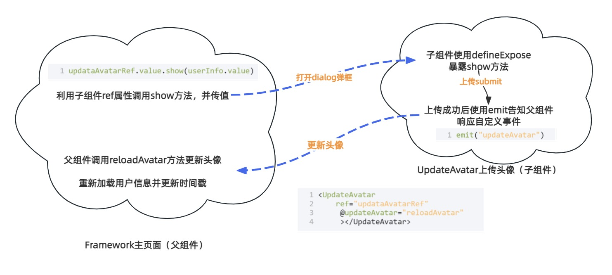

## 云盘简介

项目描述:<br>
  **[easy云盘](http://easypan.wuhancoder.com/)** 一个仿百度云盘面向C端用户的网盘项目，基于
    构建开发<br>


具体功能：
> 1.  用户注册，登录，QQ快捷登录，发送邮箱验证码，找回密码。<br>
> 2.  文件分片上传，断点续传，秒传，上传进度展示，文件预览，新建目录，文件重命名，文件移动，文件分享，删除，下载 等功能。<br>
> 3.  文件分享列表，取消分享。<br>
4.  回收站功能，还原文件，彻底删除。<br>
5.  设置模块  1、超级管理员可以看到所有用户上传的文件，可以对文件下载，删除。 2、超级管理员可以对用户进行管理，给用户分配空间，禁用、启用用户3、超级管理员可以对系统进行设置，设置邮箱模板，设置用户注册初始化空间大小。<br>
6.  用户通过分享链接和分享码预览下载其他人分享的文件，同时也可以将文件保存到自己的网盘。

> [!IMPORTANT] 前端技术栈：
> `vite` + `vue3` + `axios` + `pinia` + `router` + `js`
***


## 环境部署
#### 使用代码片段：
<span style="font-weight:bolder; color:#FE6C37">工欲善其事，必先利其器。</span>
计算机不是文科，不是天天拿记事本写代码、反复背代码单次就能学会的，所以不要折磨自己，能省事则省事，<br>
配置一个自己的代码片段，重点放在代码的思考，不要把时间浪费在重复劳动上，不然和新时代农民工有什么区别？<br>
对于代码建议，我建议买一份源码，把不必要的css直接拷贝，遇到问题可以替换源码查找病因，然后一步步找问题所在<br>
<span style="border-bottom:2px dashed #FE6C37;">代码片段不生效解决方法：新建一个新的全局代码片段文件</span>
#### 友情链接
* [老罗的Vscode代码片段](https://wwur.lanzout.com/ini770ngg78b)（密码:`fvmy`）
* [老罗的EasyShop](http://easyshop.wuhancoder.com )
* [老罗的所有免费资料](https://docs.qq.com/doc/DY1VMamFaWUttWnhi)<br>


#### 安装Node.js
版本要求：v16.20.0
* [Node.js下载](https://nodejs.org/download/release/v16.20.2/node-v16.20.2-x64.msi)

```
node -v
```
#### npm换源
npm需要切换淘宝源，淘宝换地址了，所以有的同学用不了
::: code-group

``` [查看镜像]
npm config get registry
```

``` [切换淘宝镜像]
npm config set registry https://registry.npmmirror.com/

```

:::
#### 使用自己的图标样式：
关键词搜索:`iconfont的使用与合并_iconfont怎么合并`
#### 项目构建 elementPlus的引入：
```mian.js
// 引入elemnt-plus
import ElementPlus from 'element-plus'
import 'element-plus/dist/index.css'

app.use(ElementPlus)
```
#### app.vue  Plus中文国际化（不改导致英文）
```
<script setup>
  import zhCn from 'element-plus/dist/locale/zh-cn.mjs'
  const locale = zhCn;
</script>

<template>
    <el-config-provider :locale="locale">
        <RouterView />
    </el-config-provider>
</template>
```
#### Plus弹框Message消息弹框仅一个
```
 <el-config-provider :locale="locale" :message="config">
   
<script setup>
import { reactive } from "vue";
const config = reactive({
  max: 1,
});

</script>
```

***
## 目录结构
> [!NOTE] 目录结构
├── .vscode # vscode 配置<br>
├── public # 静态资源<br>
├── src # 项目代码<br>
│   ├── assets # 静态资源、icon、公共css<br>
│   ├── components # 公用组件<br>
│   ├── js # 定义了不同文件类型的类别及其允许的文件扩展名。<br>
│   ├── utils # 工具类、包括消息提示、request请求、校验<br>
│   ├── router # 路由配置<br>
│   ├── utils # 全局工具类<br>
│   ├── views # 路由页面<br>
│   ├── App.vue # 入口vue文件<br>
│   └── main.js # 主入口文件<br>
├── index.html # 入口页面<br>
├── package.json # 项目配置文件<br>
├── vite.config.js # vite 配置<br>

## 通用组件封装
它可以帮助我们提高代码复用性和可维护性。通过封装通用组件，我们可以将组件的逻辑、样式和结构封装在一个可重用的组件中，以便在不同的页面和组件中使用。
在罗老师的项目里很多组件都是封装好的，比如弹窗组件、表格组件、上传组件等等。
#### 如何注册
Vue 注册组件有两种方式：全局注册、局部注册。

##### 1.局部注册
在对应的 Vue 页面中，使用 components 属性来注册组件。代码如下：

```
<template>
     <AvatarUpload v-model="formData.avatar"></AvatarUpload>
</template>

<script setup>
import AvatarUpload from "../componts/AvatarUpload.vue";
</script>

```
##### 2.全局注册
① 在 main.js 中，全局注册组件。代码如下：
```
import Table from '@/componts/Table.vue'
app.component("Table",Table)
```

② 在对应的 Vue 页面中，直接使用组件，无需注册。代码如下：

```
<template>
<Table
    ref="dataTableRef"
    :columns="columns" 
    :dataSource="tableData"
    >
</table>
</template>
```
基础组件我写在了另一层，点击查看

| 组件名称        |      简述      |
| ------------- | :-----------: |
| [表格](./component.md#table) | 二次封装el-table |  |
| [头像](./component.md#avatar)    |  上传头像的组件    |
| 弹窗 |   二次封装el-Dialog    |
| 弹窗 |   二次封装el-Dialog    |

## 通用方法封装
在目录 @/utils 下，封装了通用方法。<br>
公用的js函数，目的仍然是复用、高效。<br>

通用方法我写在了另一层，点击查看
| 方法名称        |      简述      |
| ------------- | :-----------: |
| [Confirm.js](./utils.md#confirm) | 提示框，二次封装Confirm |  |
| [Message.js](./component.md#table)    |  消息提示，二次封装Confirm   |
|  [Request.js](./component.md#table)   |   请求，二次封装el-Dialog    |
|  [Utils.js](./component.md#table)   |   工具类，文件大小计算    |
|  [Verify.js](./utils.md#verify)   |  表单的自定义校验    |
## 登录页面
* [undraw登录背景图片网站](https://undraw.co/search)<br>
样式书写不再阐释，主要解释代码原理

#### 1.验证码
```


const checkCodeUrl = ref(api.checkCode);
const checkCode4SendMailCode = ref(api.checkCode)
const changecheckCode = (type) => {
 if (type == 0 ){
      ***不贴代码，仅供思路
 }else{
      ***不贴代码，仅供思路
 }
};
```
具体代码就是判断返回的是0/1，判断是邮箱/登录，防止验证码被刷，然后每次请求都带一个时间戳，防止缓存

> [!IMPORTANT] 注意:
>1. src和src的区别:<br>
>加了冒号表示Vue 的动态属性绑定v-bind,用于将 src 属性的值绑定到 data() 中的一个变量，所以:src="checkCodeUrl"<br>
> 没加冒号表示静态属性绑定，所以src="/api/checkCode"<br>
>2. 为什么只要有验证码的api地址带/api的： checkCode:"/api/checkCode"？<br>
>因为这个请求没走reqest.js，request.js里面axios有个baseurl自动会给加上api，那么checkcode返回的就不是文件流，而是一个json字符串，<br>
>这样前端无法直接显示验证码图片,需要转换成base64编码在展示,直接带api接口，img的请求可以跨域，直接展示，省时省力<br>

#### 2. 登录注册页面
定义操作类型，使用v-if展示三个页面不同的模板
```
//定义操作类型 0：注册 1：登录 2：重置密码
const opType = ref(1);
const showPanel = (type) => {
  opType.value = type;
  restFrom();
};

<span v-if="opType == 0">注册</span>
<span v-if="opType == 1">登录</span>
<span v-if="opType == 2">重置密码</span>
```
#### 3. 重置表单
首先：刷新验证码
其次调用el-from的resetFields方法，作用是对整个表单进行重置，将所有字段值重置为初始值并移除校验结果，这个api element自带，可以看官方文档
判断是否是登录，是的话获取名为"loginInfo"的cookie后保存在cookieLogininfo中。
VueCookies--为现成库，具体可看官方文档，友链：https://cloud.tencent.com/developer/article/1739166

1. `changeCheckCode(0)`：这行代码调用了 `changeCheckCode` 函数，并传入参数 0。用于更新或重置验证码。
2. `formDataRef.value.resetFields()`：这行代码使用 `resetFields` 方法重置表单字段。它会清除所有表单输入字段的内容，并将表单重置为初始状态。
3. `formData.value = {}`：这行代码将表单数据对象重置为空对象。
4. 如果 `opType.value` 的值为 1，则表示当前操作是登录操作。
5. `proxy.VueCookies.get("loginInfo")`：这行代码使用 `VueCookies` 库获取名为 "loginInfo" 的 cookie 值。如果 `cookieLoginInfo` 存在（即 cookie 中有登录信息），则将 `cookieLoginInfo` 的值赋给 `formData.value`。这意味着表单数据将被之前存储的登录信息填充（记住密码）。

```
const restFrom = () => {
    ***不贴代码，仅供思路
  // 登录
  if(opType.value == 1) {
          ***不贴代码，仅供思路
    if(cookieLogininfo) {
        ***不贴代码，仅供思路
    }
  }
}
```

#### 4.自定义校验
同样使用element-ui的el-form组件自带的自定义校验，使用prop属性来指定需要校验的字段，使用rules属性来指定校验规则。
validator字段则代表自定义校验属性,此时举例邮箱和再次数据输入密码的校验

  ```
  // 校验规则
  const rules = {
  email: [
    { required: true, message: "请输入邮箱" },
    { validator: proxy.Verify.email, message: "请输入正确的邮箱" },
  ],
  reRegisterPassword: [
    { required: true, message: "请再次输入密码" },
    {
      validator: checkRePassword,
      message: "两次输入的密码不一致",
    },
  ],
  checkCode: [{ required: true, message: "请输入图片验证码" }],
};
  ```
#### 5.发送邮箱验证码

1. 使用 `validate` 方法验证表单数据。如果验证失败，则返回。
2. `const params = Object.assign({}, fromData4SendMailCode.value)`：这行代码创建了一个名为 `params` 的对象，并使用 `Object.assign` 方法将 `fromData4SendMailCode.value` 对象的所有属性复制到 `params` 对象中。
> Object.assign
> 浅拷贝，用于将所有可枚举的属性的值从一个或多个源对象分配到目标对象。
***
3. `params.type = opType.value == 0 ? 0 : 1`：这行代码根据 `opType.value` 的值设置 `params.type` 的值。如果 `opType.value` 为 0，则 `params.type` 被设置为 0，否则设置为 1。
4. `let result = await proxy.Request({...})`：这行代码发送一个请求。它使用 `proxy.Request` 方法发送请求，传入请求 URL、请求参数和错误回调函数。如果请求失败，则调用 `errorCallback` 函数，并改变验证码。
5. 如果请求成功，则显示成功消息并关闭对话框。
6. [request对象讲解可跳转](./component.md#table) 

```
// 发送邮箱验证码
const sendEmailCode = () => {
  // 验证表单数据
  fromData4SendMailCodeRef.value.validate(async (valid) => {
	***不贴代码，仅供思路
    let result = await proxy.Request({
      url: api.sendEmailCode, // 请求 URL
      params: params, // 请求参数
      errorCallback: () => {
        // 如果请求失败，则改变验证码
        changeCheckCode(1);
      },
    });
    // 如果请求失败，则返回
    if (!result) {
      return;
    }
    // 显示成功消息
    proxy.Message.success("验证码发送成功，请登录邮箱查看");
    // 关闭对话框
    dialogConfig4SendMailCode.show = false;
  });
};

```

#### 6.记住密码

```
<el-checkbox v-model="formData.rememberMe">记住我</el-checkbox>
```


只需要在登陆的时候判断即可，用户勾选了 "记住我" 复选框，那么就存入cooike，没勾选就删掉

1. `proxy.VueCookies.set("loginInfo", loginInfo, "7d")`：这行代码使用 `proxy.VueCookies.set` 方法存储一个名为 "loginInfo" 的 cookie。它将 `loginInfo` 对象作为值存储，有效期为 7 天（"7d"）。
2. `proxy.VueCookies.remove("loginInfo")`：如果 `params.rememberMe` 为假，则表示用户没有勾选 "记住我" 复选框，因此删除名为 "loginInfo" 的 cookie。
3. `proxy.VueCookies.set("userInfo", result.data, 0)`：这行代码使用 `proxy.VueCookies.set` 方法存储另一个名为 "userInfo" 的 cookie。它将 `result.data` 作为值存储，有效期为 0 天，表示这个 cookie 会在浏览器关闭时过期。

```
if(params.rememberMe){
        ***不贴代码，仅供思路
      }else{
        proxy.VueCookies.remove("loginInfo");
      }
      proxy.Message.success("登陆成功！")
      // 存储cookie
      proxy.VueCookies.set("userInfo",result.data,0)
```


#### 7.登录

处理登录、注册和重置密码的表单提交。它验证表单数据，根据操作类型设置请求参数和 URL，发送请求，并在请求成功后执行相应的操作。

1. `formDataRef.value.validate(async (valid) => {...})`：这行代码使用 `validate` 方法验证表单数据。如果验证失败，则返回。

2. `let params = {};`：这行代码创建了一个名为 `params` 的空对象，用于存储请求参数。

3. `Object.assign(params, formData.value)`：这行代码使用 `Object.assign` 方法将 `formData.value` 对象的所有属性复制到 `params` 对象中。

4. 如果 `opType.value` 为 0 或 2（注册或重置密码），则将 `params.password` 设置为 `params.registerPassword`，并删除 `params.registerPassword` 和 `params.reRegisterPassword`。

5. 如果 `opType.value` 为 1（登录），则获取名为 "loginInfo" 的 cookie，并检查用户提交的密码与 cookie 中的密码是否一致。如果一致，则对密码进行 MD5 加密。

6. 根据 `opType.value` 的值设置请求 URL。`const redirectUrl = route.query.redirectUrl || "/"; `这个是router设置好的，一般默认为主页面 / 

7. 发送请求，如果请求失败，则调用 `errorCallback` 函数并改变验证码。

8. 如果请求成功，则根据 `opType.value` 的值显示相应的消息，存储 cookie，重定向到原始页面等。

   ```
   // 登录、注册、重置密码、提交表单
   const doSubmit = () => {
     formDataRef.value.validate(async (valid) => {
       if (!valid) {
         return;
       }
        ***不贴代码，仅供思路
   
       // 注册
       if (opType.value == 0 || opType.value == 2) {
        ***不贴代码，仅供思路
       }
   
       // 登录
       if (opType.value == 1) {
            ***不贴代码，仅供思路
         if (params.password !== cookiePassword) {
               ***不贴代码，仅供思路
         }
       }
   
       // 根据操作类型设置请求 URL
       let url = null;
       if (opType.value == 0) {
         url = api.register;
       } else if (opType.value == 1) {
         url = api.login;
       } else if (opType.value == 2) {
         url = api.resetPwd;
       }
   
       // 发送请求
       let result = await proxy.Request({
         url: url,
         params: params,
         errorCallback: () => {
           changeCheckCode(0);
         },
       });
   
       // 如果请求失败，则返回
       if (!result) {
         return;
       }
   
       // 根据操作类型显示相应的消息
       if (opType.value == 0) {
            ***不贴代码，仅供思路
       } else if (opType.value == 1) {
       ↑↑↑记住密码的思路↑↑↑↑↑
       } else if (opType.value == 2) {
         ***不贴代码，仅供思路
       }
     });
   };
   
   ```
#### 8.QQ登录

前端的东西不多，给后端发请求拿回调即可

1. `let result = await proxy.Request({...})`：这行代码使用 `proxy.Request` 方法发送一个请求。请求的 URL 为 `api.qqLogin`，参数为 `{ callbackUrl: route.query.redirectUrl || "" }`。`callbackUrl` 表示回调 URL，如果 `route.query.redirectUrl` 存在，则使用它的值，否则使用空字符串。

2. `document.location.href = result.data`：这行代码将页面重定向到 `result.data` （前后端协调来的）指定的 URL（新页面）。

   ```
   const qqLogin = async () => {
     let result = await proxy.Request({
       url: api.qqLogin,
       params: {
   		 ***不贴代码，仅供思路
       },
     });
   
     if (!result) {
       return;
     }
    ***不贴代码，仅供思路
   };
   
   ```

   那么接下来就跳转到了` QqLoginCallback.vue `,这个页面也仍然只需要拿到后端返回的路径即可

   1. 使用 `proxy.Request` 方法发送一个请求，如果请求失败，则调用 `errorCallback` 函数，将用户重定向到 "/" 页面。

   2. 获取重定向 URL。如果 `result.data.callbackUrl` 存在，则使用它的值，否则使用 "/" 作为重定向 URL。如果重定向 URL 为 "/login"，则将其更改为 "/"。

      ```
        <script setup>
        const login = async () => {
          let result = await proxy.Request({
            url: api.logincallback,
            params: router.currentRoute.value.query,
            errorCallback: () => {
             ***不贴代码，仅供思路
            },
          });
          if (!result) {
            return;
          }
        
      		***不贴代码，仅供思路
          if (redirectUrl == "/login") {
      		***不贴代码，仅供思路
          }
         		***不贴代码，仅供思路
        };
        login();
        </script>
      ```

      ##### 路由守卫

      检查用户是否已登录。如果目标路由需要登录，并且用户尚未登录（`userInfo` 为空），则将用户重定向到 "/login" 页面。否则，允许路由继续进行。

      1. `(to, from, next) => {...}`：这是 `router.beforeEach` 钩子函数的参数。`to` 表示目标路由，`from` 表示当前路由，`next` 是一个函数，调用它可以继续执行管道中的下一个钩子。
      2. `const userInfo = VueCookies.get("userInfo")`：这行代码使用 `VueCookies.get` 方法获取名为 "userInfo" 的 cookie 值。`userInfo` 可能包含用户登录信息或其他身份验证令牌。
      3. `if (to.meta.needLogin != null && to.meta.needLogin && userInfo == null) {...}`：这是一个条件语句，检查目标路由 (`to`) 的元信息 (`meta`) 中的 `needLogin` 属性。如果 `needLogin` 不为空且为真，并且 `userInfo` 为空，则表示用户需要登录，但尚未登录。
      4. `router.push("/login")`：如果满足上述条件（未登录），则使用 `router.push` 方法将用户重定向到 "/login" 页面。这通常用于提示用户登录或显示登录表单。
      5. `next()`：调用 `next` 函数，继续执行管道中的下一个钩子，允许路由继续进行。

      ```
      router.beforeEach((to, from, next) => {
        const userInfo = VueCookies.get("userInfo");
        if (to.meta.needLogin != null && to.meta.needLogin && userInfo == null) {
          router.push("/login");
        }
        next();
      })
      ```

***


## 框架页
<span style="font-weight:bolder; color:#72BD49">Framework.vue/html部分不再赘述</span>


#### 1.动态设置图标的样式

使用了v-for指令遍历menus数组，并生成相应的HTML代码。

- 第一个div元素用于设置图标样式，
- 第二个div元素则用于展示菜单项文本内容。

```
  <div class="menu-item" v-for="item in menus" :key="item.id">
  <div :class="['iconfont','icon-'+ item.icon]"></div>
  <div class="text">{{ item.name }}</div></div>
```


#### 2.子路由设置
二级菜单的跳转跳转
```
   <div class="body-content">
      <router-view v-slot="{Component}">
         <component :is="Component"></component>
      </router-view>
    </div>
```
如果 data.path 存在且 data.menuCode 与当前选中的菜单项的代码不同，
则使用 router.push 导航到 data.path 指定的路径。否则，函数返回，不执行任何操作。
```
const jump = (data) => {
  if(!data.path || data.menuCode == currentMenu.value.menuCode){
    return;
  }
  router.push(data.path);
}

```

#### 3.监听：二级菜单更改路由 
当路由对象的meta属性中有menuCode属性时，会调用setMenu方法来设置菜单代码和路由路径。

第一个参数是一个函数，返回要监听的对象或值，这里是route对象。第二个参数是一个回调函数，当监听到变化时会执行该回调函数。第三个参数是一个选项对象，其中immediate表示是否在watch被创建后立即执行一次回调函数，deep表示是否深度监听对象的变化。
```
 watch(
  () => route,
  (newVal, oldVal) => {
    if(newVal.meta.menuCode) {
    setMenu(newVal.meta.menuCode, newVal.path);
  }
},
 { immediate: true, deep: true }
);
```
#### 4.利用routerview达成父子组件传参
业务需求：需要各个子组件和主页面进行数据交互，所以这里的处理真的很棒！<br>
v-slot="{Component}" 是Vue.js中的作用域插槽语法，它允许父组件访问子组件的数据或属性<br>
component 是Vue.js中一个特殊的组件，它可以动态地渲染为任何组件。<br>
:is="Component" 使用 v-bind 简写语法（:is），将 Component 的值绑定为要渲染的组件类型。这样，将根据 Component 的值渲染成对应的组件<br>
```
<div class="body-content">
      <router-view v-slot="{Component}">
         <component/>
      </router-view>
    </div>
```


***

## 上传头像
这里是第一次使用父子组件的知识，大差不大，所以我做了一个图来理解，看懂这个之后，父子组件传参就很好理解了。
主要的知识就是ref和emit，v-model的使用。
* ` ref="updataAvatarRef" `通过 ref 属性，组件实例被引用到了一个响应式引用 updataAvatarRef 中。这意味着你可以通过 `updataAvatarRef.value` 访问到 子组件的实例，从而可以调用它的方法或访问其属性。<br>
* `@updateAvatar="reloadAvatar"`:为 UpdateAvatar 组件的 updateAvatar 事件添加了一个监听器，当组件内部触发 updateAvatar 事件时，会调用父组件中的` reloadAvatar` 方法。


查看头像组件在此介绍：[Avatar.vue](./component.md#avatar)<br>

#### 主页面：

父组件：这里的知识点是通过子组件的ref属性来调用show方法，而show方法就是子组件弹框打开的方法。
所以做到了解耦，当点击上传头像时，传给子组件userinfo信息

```
   <UpdateAvatar 
    ref="updataAvatarRef"
     @updateAvatar="reloadAvatar"
     ></UpdateAvatar>

     // 修改头像
  const updataAvatarRef = ref();
  const updataAvatar = () =>{
  updataAvatarRef.value.show(userInfo.value)
};
```
子组件：使用defineExpose来暴露出show方法，这样父组件就可以通过ref来调用show方法了。
在父组件调用show时做了一下两件事：
1.浅拷贝，将 data 对象的所有属性和值复制到一个新的对象中，然后将这个新对象赋值给 formData.value。这样做是为了避免直接修改原始数据 data，从而防止副作用和数据污染
2.覆盖原有的userid和avatar或创建了新的对象，使其包含用户ID和头像URL
3.打开了dialog弹框
```
const show =(data) =>{
  formData.value = Object.assign({},data);
  formData.value.avatar = {userId:data.userId,qqAvatar:data.avatar};
  dialogConfig.value.show = true;;
}
defineExpose ({ show })
```

#### 上传头像弹框 

` views/UpdateAvatar.vue `<br>

1.首先检查formData.value.avatar是否是一个文件类型。<br>
2.发送一个请求来更新用户头像.<br>
3.从代理对象中获取名为"userInfo"的cookie信息，删除其中的avatar字段。<br>
4.再将更新后的cookie信息重新设置回"userInfo"中，过期时间为0，即立即过期。最后，触发"updateAvatar"事件，显示头像修改成功的消息提示。<br>
5.关闭弹框。<br>
```
const submitForm = async () => {
  if(!(formData.value.avatar instanceof File)){
     		***不贴代码，仅供思路
    return
  }
  let result = await proxy.Request({
    url:api.updateUserAvatar,
    params:{
      avatar:formData.value.avatar,
    }
  });
  		***不贴代码，仅供思路
}
```
#### 上传头像组件

 ` component/AvatarUpload.vue `<br>

emit是父子组件传参使用的，`@update:modelValue` 监听子组件的modelValue变化，<br>

* h5片段
分为一个查看组件和一个上传组件，上传就是el-upload，如果 localFile 存在（即用户已经选择了一个本地文件），则显示本地文件的预览。在上传前预览图片。如果没有本地文件，则展示远程头像 URL。
* js片段
1.先提取出实际的文件对象，可以直接打印file对象，里面的file即是后端所需要的File流文件。<br>
2.创建一个新的 FileReader 对象，读取文件内容。<br>
3.使用 readAsDataURL 方法读取文件并转换为Data URL格式，这是一种包含文件数据的文本字符串，常用于图像预览。<br>
4.设置 onload 事件处理器，当文件读取完成时触发。事件对象通过解构赋值的方式获取 target 属性，即 FileReader 对象。<br>
5.当文件读取完成后，将读取结果（Base64编码的图像数据）存储在 localFile 引用中。<br>
6.触发父组件 update:modelValue 事件
```
const uploadImage = async (file) => {
     		***不贴代码，仅供思路
    img.onload = ({ target }) => {
      		***不贴代码，仅供思路
    };
    emit("update:modelValue",file);
}
```
## 修改密码和退出登录
* 修改密码

思路和上传头像一样，没有区别；<br>
其次就是修改密码的方法调用，validator表单验证，然后异步请求代码验证是否成功请求参数修改密码<br>
成功后关闭弹窗，这里可以加跳转登录页<br>

* 退出登录
1.首先调用对话框，发送异步请求给后端发送退出请求
2.回调成功后首先清除cookies里的用户信息，然后跳转到登录页面
```
<el-dropdown-item @click="logout">退出</el-dropdown-item>
// 退出
const logout = async () => {
  proxy.Confirm('你确定要退出吗',async( ) => {
    let result = await proxy.Request({
    url:api.logout,
  });
  if(!result) {
    return
  }
  proxy.VueCookies.remove("userInfo");
  router.push("/login")
  })
 
};
```

***


## 文件列表

**到-P11文件列表啦**
封装了table组件，可以去通用组件-table去看
> Views/main/mian.vue
```
   <Table
        ref="dataTableRef"   //获取表格实例
        :columns="columns"   //列名
        :showPagination="true" //是否分页
        :dataSource="tableData" //数据来源
        :fetch="loadDataList" //数据请求方法（是否在组件初始化时获取数据）
        :initFetch="false"    //初始化请求
        :options="tableOptions" //表格配置项（有没有checkbox/表格高度设置）
        @rowSelected="rowSelected" //行点击
      >
        <template #fileName="{ index, row }">  ///具名插槽
        </template>
   </Table>
```
插槽知识:
要为具名插槽传入内容，我们需要使用一个含 v-slot 指令的 `<template>` 元素，并将目标插槽的名字传给该指令：
v-slot 有对应的简写 #，因此 `<template v-slot:fileName> `可以简写为 `<template #fileName>`。其意思就是“将这部分模板片段传入子组件的 header 插槽中”。
由表格组件传递 index（索引）, row（表格数据对象）


***

## 上传文件

### 子父父子传参 封装组件

#### 组件名称代码解释

- **Main.vue（父组件）使用:**
  - 使用`http-request`指令将`addFile`方法绑定到一个HTTP请求事件上。
  - 定义了一个自定义事件"addFile"，并通过`emit`函数触发该事件。

- **Framework.vue（路由子组件）:**
  - 监听来自Main.vue的"addFile"事件，并调用`addFile`方法进行处理。
  - 在`addFile`方法中，设置`showUploader.value`为true以显示Uploader组件，调用`uploaderRef`引用的Uploader组件的`addFile`方法。

- **Uploader.vue（直接子组件）:**
  - 定义了`addFile`方法，用于接收文件和文件父级ID进行具体的上传文件操作。
  - 使用`defineExpose`函数将`addFile`方法暴露给其他组件以供调用。

#### 协作过程：

- Main.vue组件（路由子组件）中负责选择文件，然后通过自定义事件的方式触发Framework.vue组件的`addFile`方法，并且传递了`file`这个blob。
- 在Framework.vue组件中，主动显示`el-popver`组件，最后调用Uploader.vue组件的上传方法，并传入`file`这个blob。
- 文件上传完成后，Uploader.vue组件通过自定义事件通知Framework.vue组件，Framework.vue再通过`router-view`的组件写法调用路由子组件中所暴露的方法去刷新文件列表。

#### 文件上传逻辑

- **Main.vue:**
  - 当接收到HTTP请求时，调用`addFile`方法处理上传的文件。
  - `addFile`方法接受一个`fileData`参数，通过`emit`函数触发了"addFile"事件，并传递文件和文件父级ID的对象作为参数。

- **Framework.vue:**
  - 使用`@addFile`监听器捕获Main.vue组件中触发的"addFile"事件。
  - 在`addFile`方法中，解构出`file`和`filePid`属性，设置`showUploader.value`为true，并调用Uploader组件的`addFile`方法。

- **Uploader.vue:**
  - `addFile`方法接收`file`和`filePid`参数，进行上传文件的处理逻辑。
  - 使用`defineExpose`函数将`addFile`方法暴露出来。

#### H5+C3部分：

- 两个`span`为标题
- `el-progress`进度条，包含图标和标签
- `el-progress`（转圈的图标）

#### 将文件添加到下载列表

1. 定义了一个名为`STATUS`的常量对象，用于表示文件上传的不同状态。
2. 创建了一个`fileItem`对象来存储文件的信息，并插入到文件列表的最前面。
3. 判断文件总大小是否为0，设置文件状态并异步计算文件的MD5值。
4. 调用`uploadFile`函数上传文件，传入MD5值。

***

## 上传文件-md5分片

### 理论流程
MD5分片操作是将大文件分割成多个小块，并分别对这些小块进行MD5哈希计算的过程。这一过程的主要步骤包括：

> 1.定义分片大小：首先，需要确定每个分片的大小，常见的分片大小有4KB、8KB等。<br>
> 2.切割文件：按照预设的分片大小，将大文件切割成多个连续的小块。<br>
> 3.计算MD5值：对每个分片分别进行MD5哈希计算，得到唯一的MD5值。<br>
> 4.记录MD5值：将每个分片的MD5值记录下来，以备后续使用。<br>
> 5.验证文件完整性：在文件传输或存储的过程中，接收方可以通过计算接收到的分片的MD5值，并与记录的MD5值进行比对，以验证文件的完整性。<br>

### 本项目流程
🎉本项目流程主要包括 `初始化` 、 `计算MD5值` 和 `上传分片` 三个阶段。
::: tip 具体步骤如下：
1. 初始化
获取文件对象：通过fileItem.file获取文件对象。
确定切片方法：根据浏览器兼容性确定文件切片方法，如File.prototype.slice、File.prototype.mozSlice或File.prototype.webkitSlice。
2. 计算MD5值
计算切片数目：根据文件大小和每个切片的大小计算出切片的总数。
初始化索引：将当前处理的切片索引currentChunk初始化为0。
创建MD5实例：使用SparkMD5.ArrayBuffer创建一个用于计算MD5的实例。
创建文件读取器：使用FileReader对象用于读取文件内容。
读取并处理切片：定义loadNext函数，用于读取当前索引对应的切片内容，并将其添加到MD5实例中进行计算。然后更新索引，并在还有剩余切片的情况下继续读取下一个切片。
3. 上传分片
获取文件UID：通过getFileByUid函数根据文件的UID获取文件对象。
上传文件：使用uploadFile函数，根据文件的UID和初始分片索引开始上传文件。在循环中检查是否有删除或暂停上传的请求，并根据分片索引上传文件至服务器。
添加文件到列表：通过addFile函数接收父文件信息，创建文件对象，并计算其MD5值后添加到文件列表中。
:::
***

## 上传文件-上传

doing....

***

## 删除-移动文件

doing....

***

## 目录导航/面包屑

doing....

***

## 使用空间/图片预览

doing....

***

## 分享

doing....

***

## 回收站

doing....

***

## 外部分析

doing....

***